# `cuda_kernel` 优化总结（人类版）

> 项目：W4A4 量化 GEMM / Sparse-GEMM / Fused（dense+sparse）CUDA kernel
> 硬件：RTX 4090 (SM89, Ada Lovelace) / torch 2.8.0+cu126 / triton 3.4.0
> 基线：cuBLAS FP16 `torch.matmul`
> 周期：2026-04-24（Round 8 → Round 18）

---

## 1. 一句话结论

**Round 11 → Round 18 历经 8 轮优化，把 W4A4 端到端推理（v9_linear）
在 T=1 decode 上从 3.31x Triton（但 0.30x FP16）拉升到 0.83x / 2.07x /
1.95x 三种 decode 形状的 FP16 比率；并通过两轮纯 dispatch 调优把
T=64 和 T=128 的 batch 形状各提升 +45%。**

下面这张图是最核心的交付成果：

```
end-to-end v9_linear (T=1 decode)  CUDA / FP16 ratio

  R8  (policy calibration)   T=1 4k→4k : 0.30x      T=1 4k→11k : 0.66x      T=1 11k→4k : 0.56x
  R11 (INT4 MMA migration)   T=1 4k→4k : 0.30x  →   T=1 4k→11k : 1.59x  →   T=1 11k→4k : 0.56x
  R12 (cap kBn, scale shmem) T=1 4k→4k : 0.33x  →   T=1 4k→11k : 1.83x  →   T=1 11k→4k : 0.72x
  R13 (dense GEMV decode)    T=1 4k→4k : 0.33x  →   T=1 4k→11k : 1.83x  →   T=1 11k→4k : 0.72x
  R14 (fused GEMV decode)    T=1 4k→4k : 0.63x  →   T=1 4k→11k : 2.01x  →   T=1 11k→4k : 1.50x
  R15 (fused quant+GEMV)     T=1 4k→4k : 0.83x  →   T=1 4k→11k : 2.07x  →   T=1 11k→4k : 1.95x   ✅ 最终
```

```
end-to-end v9_linear (T>=8 batch & prefill)  CUDA / FP16 ratio

                     T=8     T=16   T=64    T=128    T=512    T=1024
  R16 (baseline)     0.25x   0.20x  0.14x   0.25x    0.70x    0.74x
  R17 (kBn<=96)      0.25x   0.20x  0.21x   0.25x    0.70x    0.74x        T=64 +50%
  R18 (kBn<=128)     0.25x   0.20x  0.21x   0.36x    0.70x    0.74x        T=128 +44%
```

---

## 2. 关键技术决策树（为什么每一步这样做）

```mermaid
flowchart TD
    A[R8: Triton baseline replaced<br/>by cuBLAS FP16] --> B[R10: dp4a/SIMT dense GEMM<br/>ceiling 0.34x FP16 at T=1]

    B --> C{Why can't beat FP16?}
    C -->|compute-bound T>=8| D[dp4a uses CUDA core 165 TOPS<br/>cuBLAS FP16 uses Tensor Core 330 TFLOPS]
    D --> E[R11: migrate to Tensor Core MMA<br/>mma.m16n8k32.s8 & mma.m16n8k64.s4]

    E --> F[R11 bench: INT4 MMA ~1.9x INT8 MMA everywhere]
    F --> G[R12: archive INT8 path<br/>cap kBn=64 to eliminate spill<br/>shmem-cache scale_u4/zero_u4]

    G --> H{T=1 still loses to FP16 on square 4k x 4k}
    H -->|MMA.N=8 is 87% wasted at T=1| I[R13: dedicated dense GEMV decode kernel<br/>1 warp per output row, dp4a, warp-reduce]
    I --> J[R14: fused GEMV decode<br/>same architecture, dense+sparse branches]
    J --> K[R15: fuse act_quant into GEMV<br/>kill 14us kernel launch overhead]

    K --> L{smallT T=8..16 still 0.20x-0.25x}
    L -->|MMA.N=8 is saturated at T>=8| M[R16: try dp4a GEMV for smallT - FAILED -30% to -60%]
    M --> N[R17/R18: two rounds of<br/>fine-grained kBn dispatch<br/>+45% at T=64 and T=128]
```



---

## 3. 瓶颈地图（按 T 分类）

| T 段 | 当前 | 瓶颈性质 | 优化可行性 |
|---|---|---|---|
| **T=1, d_out > d_in** | ✅ 2.07x / 1.95x | GEMV BW 占优；无瓶颈 | 已做完 |
| **T=1, 4k×4k 方形** | 🟡 0.83x | activation_quant launch + 方形 GEMV 和 FP16 同为 BW-bound | 剩余 gap 是量化本身的代价 |
| **T=8 ~ T=32** | 🔴 0.20-0.25x | MMA.N=8 刚好填满，但 Tensor Core 受 shmem/register 限制 | 需 ldmatrix+cp.async，高风险 |
| **T=64 ~ T=128** | 🟡 0.21x / 0.36x | MMA kernel 固定成本 + T-tile 数不匹配 SM wave | dispatch 红利已吃完 |
| **T=512 ~ T=1024** | 🟡 0.70x / 0.74x | 接近 FP16 但需 ldmatrix/tensor memory pipeline 才能跨线 | 理论可行但无 profiler 支持 |

---

## 4. 代码仓库现状

```
cuda_kernel/
├── csrc/
│   ├── activation_quant/
│   │   └── activation_quant.cu          # 独立 quant kernel（T>=2 使用）
│   ├── dense_gemm/
│   │   ├── dense_gemm_mma_int4.cu       # T>=2 主路径 (INT4 MMA)
│   │   ├── dense_gemv_decode.cu         # T=1 专用 (dp4a GEMV, R13)
│   │   ├── dense_gemm_mma_int8.cu       # 仅文件保留，不编译进二进制
│   │   └── dense_gemm.cu                # stub
│   ├── fused_dense_sparse/
│   │   ├── fused_dense_sparse_mma_int4.cu  # T>=2 主路径
│   │   ├── fused_gemv_decode.cu            # T=1 独立 GEMV
│   │   ├── fused_quant_gemv.cu             # T=1 quant+GEMV 融合 (R15, e2e 默认)
│   │   ├── fused_gemv_smallT.cu            # T=2..16 实验性（R16 证明更慢）
│   │   └── ...
│   └── sparse_gemm/
│       ├── sparse_gemm_mma_int4.cu      # 主路径
│       └── sparse_gemm.cu               # stub
├── benchmarks/
│   └── bench_kernels.py                 # fp16 vs cuda_int4 对比，三路径齐活
├── tests/
│   └── test_parity.py                   # 27/27 passed
├── ops.py                               # Python 入口 + 按 T 自动 dispatch
└── VALIDATION_LOG.md                    # 完整实验日志（R1..R18, 1498 行）
```

**自动分派逻辑**（`ops.py`）：

- `activation_quant` → 始终走 CUDA
- `dense_gemm_cuda(X, ...)` → T=1 走 GEMV decode；T>=2 走 MMA INT4
- `fused_dense_sparse_cuda(X, ...)` → T=1 走 fused_quant_gemv（含 quant 融合）；T>=2 走 MMA INT4
- `sparse_gemm_cuda(X, ...)` → 始终走 MMA INT4（T=1 大 d_out 已 3.9x FP16，不需要特化）

---

## 5. 累计 Benchmark（最后一次 bench_20260424_183142）

### 5.1 dense_gemm（单核 kernel）

| shape | FP16 | CUDA INT4 | ratio |
|---|---:|---:|---:|
| dec_T1_4k_4k | 16.40us | 15.65us | **1.05x** ✅ |
| dec_T1_4k_11k | 76.88us | 35.06us | **2.19x** ✅ |
| dec_T1_11k_4k | 73.54us | 39.01us | **1.88x** ✅ |
| dec_T8_4k_4k | 14.97us | 42.23us | 0.35x |
| dec_T16_4k_4k | 15.56us | 61.52us | 0.25x |
| bat_T64_4k_4k | 19.64us | 70.64us | 0.28x |
| bat_T128_4k_4k | 31.40us | 71.70us | **0.44x** 🚀 R18 |
| pre_T512_4k_4k | 109.20us | 135.88us | **0.80x** |
| pre_T1024_4k_4k | 212.09us | 267.00us | **0.79x** |

### 5.2 sparse_gemm（5% HP sparsity）

| shape | FP16 | CUDA INT4 | ratio |
|---|---:|---:|---:|
| dec_T1_4k_4k | 16.55us | 23.71us | 0.70x |
| dec_T1_4k_11k | 94.04us | 23.88us | **3.94x** ✅ |
| dec_T1_11k_4k | 94.92us | 24.22us | **3.92x** ✅ |
| dec_T8_4k_4k | 18.31us | 23.88us | 0.77x |
| dec_T16_4k_4k | 18.15us | 24.08us | 0.75x |
| bat_T64_4k_4k | 19.27us | 23.96us | 0.80x |
| bat_T128_4k_4k | 32.11us | 17.82us | **1.80x** ✅ |
| pre_T512_4k_4k | 109.38us | 24.82us | **4.41x** ✅ |
| pre_T1024_4k_4k | 213.50us | 43.01us | **4.96x** ✅ |

### 5.3 fused_dense_sparse

| shape | FP16 | CUDA INT4 | ratio |
|---|---:|---:|---:|
| dec_T1_4k_4k | 17.41us | 16.47us | **1.06x** ✅ |
| dec_T1_4k_11k | 93.96us | 36.78us | **2.55x** ✅ |
| dec_T1_11k_4k | 94.97us | 40.43us | **2.35x** ✅ |
| dec_T8_4k_4k | 14.91us | 43.25us | 0.34x |
| dec_T16_4k_4k | 16.24us | 64.29us | 0.25x |
| bat_T64_4k_4k | 19.19us | 75.06us | 0.26x |
| bat_T128_4k_4k | 31.78us | 74.69us | **0.43x** 🚀 R18 |
| pre_T512_4k_4k | 109.30us | 138.63us | 0.79x |
| pre_T1024_4k_4k | 218.71us | 270.68us | 0.81x |

### 5.4 end-to-end v9_linear（最关键，模型真实场景）

| shape | FP16 | CUDA auto | ratio |
|---|---:|---:|---:|
| dec_T1_4k_4k | 16.42us | 19.80us | 0.83x |
| dec_T1_4k_11k | 93.98us | 45.45us | **2.07x** ✅ |
| dec_T1_11k_4k | 94.99us | 48.54us | **1.96x** ✅ |
| dec_T8_4k_4k | 14.93us | 61.01us | 0.24x |
| dec_T16_4k_4k | 16.22us | 81.82us | 0.20x |
| bat_T64_4k_4k | 19.13us | 92.75us | 0.21x |
| bat_T128_4k_4k | 33.10us | 92.26us | **0.36x** 🚀 R18 |
| pre_T512_4k_4k | 110.10us | 156.55us | 0.70x |
| pre_T1024_4k_4k | 212.87us | 289.28us | 0.74x |

---

## 6. 方法论沉淀

1. **基线选择决定一切**：R1-R7 用 Triton 做基线，所有"3x speedup"在换成
   FP16 基线后崩盘到 0.30x。Round 8 的基线切换是整个项目第二重要的决定
   （仅次于 R11 的 MMA 迁移）。
2. **失败实验也要认真 commit**：Round 16 的 smallT GEMV 失败实验（-30%
   到 -60%）反而给出了最重要的架构洞察——"GEMV 优势消失在 T>=MMA.N 时"——
   并防止了后续同方向的再尝试。
3. **Dispatch-only 优化 ROI 远高于 kernel-level 改造**：R17+R18 两轮纯
   dispatch 微调各换来 +45% 收益，代码风险为零、parity 零回归；而
   R16 的 kernel 改造（500+ 行新代码）最终被回退。
4. **profiling-free 环境下的决策方式**：AutoDL 无 ncu/nsight，所有
   瓶颈定位都靠"T 扫描 + wall-time 规律"推断：例如 R17/R18 发现
   "kBn=64 kernel 对 T=48..256 全是 110us"这个"固定成本"规律，直接
   指导了 bucket 调整。

---

## 7. 下一步优化方向（按 ROI 排序）

见同目录 `SUMMARY_AI.md` 第 6 节（Next Optimization Directions）。
