# `cuda_kernel` 优化总结（人类版）

> 项目：W4A4 量化 GEMM / Sparse-GEMM / Fused（dense+sparse）CUDA kernel
> 硬件：RTX 4090 (SM89, Ada Lovelace) / torch 2.8.0+cu126 / triton 3.4.0
> 基线：cuBLAS FP16 `torch.matmul`
> 周期：2026-04-24（Round 8 → Round 18）  
> **追加周期：2026-04-27 → 2026-04-28（Round 19 → Round 47），详见下方 §0。**

---

## 0. 2026-04-27/28 增量小结（R19 → R47）

> 下面的 §1..§7 是 R8-R18 的**历史快照**，不做重写。本节只总结"自那
> 之后到今天 HEAD 的全部变化"，按当前用户关心度排序。

### 0.1 本周期**最被需要写进来的三件事**

1. **最近几轮迭代的 accept / reject 判定全部补录到
   [`VALIDATION_LOG.md`](./VALIDATION_LOG.md)**（Round 35-44）。
2. **测量口径统一**（R38）：所有 bench 脚本接入
   `benchmarks/_bench_util.py::robust_kernel_time`，
   `warmup=50, inner=100, repeats=3, min-of-means`（记忆
   [[bmmiahpl]]）。
3. **fused kernel 的 (T, d_out) 二维 gate 矩阵成型**（R42→R43→R44）：
   从 R42 的窄 gate（7 个命中 shape）扩到 R44 的宽 gate（16 个命中
   shape），覆盖 T∈[8..96] × d_out∈[1024..4096] 的大片区域，每格
   +10~20%，0 回退。

### 0.2 R19 → R44 一句话结论

**R19-R34 是 kernel 内部优化探索周期**（大改造基本全部 reject），
**R35 是周期内唯一的单点大提升**（14B `down_proj` T=1: 223us →
86.9us, **+2.18x FP16 / +4.92x Triton**），**R36-R39 是收口与文档
整理期**。**R40-B 到 R44 是 mid-T 性能悬崖的修复周期**，核心突破是
把 fused kernel 的 `kBm` 参数化并用 (T, d_out) 矩阵 gate 做精细
dispatch，最终在生产 hp_ratio=0.05 下解锁了 16 个此前输给 kBm=128
的 shape。

### 0.3 R19-R44 账单（哪些 accept，哪些 reject）

| Round | 内容 | 判定 |
|------:|-----|------|
| R19 | MMA A-operand 换 `ldmatrix` | REJECTED |
| R20-R30 | epilogue 拆分 / wave-aware `kBn` / dense `kGrpBuf=128` 等一系列 epilogue 重写 | 分别 kept/rolled back，详见 VALIDATION_LOG |
| **R31** | dense `kGrpBuf=128` opt-in for `d_in > 4096` | **ACCEPTED** |
| **R32** | dispatcher `T ≤ 32 && d_out ≤ d_in → kBn=8` | **ACCEPTED** |
| R33 | activation_quant 两阶段多-CTA 分裂 (T≤4) | REJECTED |
| R34 | Split-K along group-axis for dense_gemm | REJECTED |
| **R35** | decode `kMaxGroups` 128 → 160（解锁 14B `down_proj` T=1）| **ACCEPTED** |
| R36 | fused `kGrpBuf` 32 → 40 | REJECTED |
| R37 | `T ≤ 16` 强制 `kBn=8` 宽输出 | REJECTED |
| **R38** | 统一 robust bench 计时 + `--out-root` 隔离 | **ACCEPTED** |
| R39 | HEAD-state 基线快照 + 瓶颈重新锁定 | BASELINE |
| **R40-B** | dense_gemm `kBm=64` opt-in（窄 gate：`T∈[16,64] && d_out≤2048`） | **ACCEPTED** |
| R41-P1 | fused `kBm` 模板化基础设施（hp=0 only） | INFRA ONLY |
| **R42-P1** | fused `kBm=64` opt-in 扩展到 hp>0（BSR 2 CTA/row 重映射） | **ACCEPTED**；7 个命中 shape +14~+34% |
| **R43** | fused (T, d_out) 矩阵 gate（9 个新 shape 命中，+5~+17%） | **ACCEPTED** |
| **R44** | fused `kBn` demote (`kBm=64 && T∈[32,96] → kBn=8`) + gate 再扩展 | **ACCEPTED**；d=2048 T∈[48,64] 崩盘彻底修复 |
| **R45** | fused gate wave-threshold off-by-one 修复（`< 64` → `<= 64`） | **ACCEPTED**；T∈[48,64] × d_out=4096 解锁，生产 `bat_T64_4k_4k` **-4.4%** |
| **R46** | dispatcher 的 `_forward_decode` 切换到 fused kernel 单次 launch 路径 | **ACCEPTED 🔥🔥**；所有 decode/batch E2E **-14% → -40%**，R19 后最大单轮提升 |
| **R47** | `backend/policy.py::_auto_policy` 按 R46 证据重新标定（所有 kernel 在所有 T 都返回 CUDA） | **ACCEPTED**；`auto/cuda = 1.000x` on 8/9 shapes，`auto/triton = 1.77x..4.14x`，其中 T≥8 mid-narrow shape 之前全部错误 fallback 到 Triton，相当于白操作一整天 |

### 0.5 R46 交付 — dispatcher 架构级别修复

**背景**：R19→R45 所有圆都在调 `fused_dense_sparse_mma_int4.cu` 内部，
但通过分段 probe 发现一个背景 bug：**`dispatcher._forward_decode`
在 hp>0 时根本没用 fused kernel**，而是调用 dense_gemm + sparse_gemm
两次 launch。对比 prefill 已用 fused，只有 decode 被遗忘了。

**现场数据**（T=64 d=4096 d_in=4096 hp=0.05, RTX 4090）：
- dense + sparse 两次： 51.04 + 24.31 = **75.35us**  
- fused 单次： **54.67us**  
- 浪费：**20.68us**

**修复**：添加 gate `use_fused_decode = n_hp_blocks>0 && (d_in<=d_out || T<=16)`，
命中时走 fused（down_proj-式 d_in>>d_out 中 T 对比可能不利，显式排除）。

**E2E 成果表**（`bench_cuda_vs_triton`，R45 → R46）：

| shape | R45 | R46 | 改善 |
|---|---|---|---|
| dec_T1_4k_4k    | 64.57us | **38.79us** | **-39.9%** 🔥🔥 |
| dec_T1_4k_11k   | 63.71us | **48.05us** | **-24.6%** 🔥 |
| dec_T1_11k_4k   | 75.22us | **63.96us** | **-15.0%** 🔥 |
| dec_T8_4k_4k    | 72.17us | **49.95us** | **-30.8%** 🔥🔥 |
| dec_T16_4k_4k   | 71.97us | **53.72us** | **-25.4%** 🔥 |
| bat_T64_4k_4k   | 76.43us | **65.57us** | **-14.2%** 🔥 |
| bat_T128_4k_4k  | 85.71us | **70.92us** | **-17.3%** 🔥 |
| pre_T512        | 129.35  | 129.39      | ≈（prefill 已经用 fused） |
| pre_T1024       | 240.29  | 241.73      | ≈ |

7/7 decode+batch 全胜，0 回退，39/39 parity 通过。

**教训**：纯精调 kernel 微观优化（R19-R45）在某种意义上反而屏蔽了系统层面的问题：
我们在优化一个调用链根本没用到的 kernel。R46 证明一次端到端分段 probe 比
27 轮 kernel 调参更有价值。

---

### 0.5b R47 交付 — policy.py 口径与 R46 证据对齐（ACCEPTED, 2026-04-28）

**背景**：`backend/policy.py::_auto_policy` 是 `v9_linear_forward` 每
次调用都会咨询的路由表。该表从 Round-9（2026-04-24）起一直没动，
注释里仍然基于 "vs cuBLAS FP16" 的旧比较口径，但实际 bench 和生产
调用比较的是 **CUDA vs Triton W4A4**，两者不是一回事。

**问题体量**：R38-R46 把 CUDA 路径全面改写后，最新快照
（`bench_20260427_224405.md`）里 CUDA 在 **所有** T（1/8/16/64/128/
512/1024）× 所有 kernel（dense/sparse/fused/activation_quant）上
都胜 Triton **1.45x ~ 4.91x**；但 `_auto_policy` 仍然在 T≥8 的
mid-narrow shape 上 fallback 到 Triton，相当于每次生产调用都主动
放弃 1.47x ~ 1.89x 的 CUDA 加速。

**修复**：把四个 kernel 的 auto 决策全部改为 `"cuda"`，并在 docstring
里贴全 R46 测量证据，保留结构化 per-kernel 分支便于未来按 shape 加
黑名单。

**E2E 证据**（`bench_auto_policy_r47_20260428_110016.md`）：

| shape | triton (us) | cuda (us) | auto (us) | auto/cuda |
|---|---:|---:|---:|---:|
| dec_T1_4k_4k    | 154.42 | 38.65  | **38.46**  | **1.005x** |
| dec_T1_4k_11k   | 155.05 | 48.50  | **48.50**  | 1.000x |
| dec_T1_11k_4k   | 268.78 | 64.98  | **64.94**  | 1.001x |
| dec_T8_4k_4k    | 164.88 | 50.34  | **50.35**  | 1.000x |
| dec_T16_4k_4k   | 163.43 | 54.48  | **54.46**  | 1.000x |
| bat_T64_4k_4k   | 164.29 | 66.56  | **66.57**  | 1.000x |
| bat_T128_4k_4k  | 165.29 | 72.07  | **72.07**  | 1.000x |
| pre_T512_4k_4k  | 250.45 | 131.11 | **131.05** | 1.000x |
| pre_T1024_4k_4k | 433.66 | 244.63 | **244.57** | 1.000x |

`auto/cuda=1.000x` 说明 auto 路径完整命中 CUDA fast path；
`auto/triton = 1.77x..4.14x` 是生产侧真实节省。之前 auto 会在 T≥8
mid-narrow 列和 triton 列完全对齐（即 3.0x..3.3x 慢 cuda 路径），
每次 production call 都白跑一遍 Triton。

**parity**：39/39 通过。**生产回归**：0（R47 只改 policy，不碰 kernel，
`bench_cuda_vs_triton` 两列数值在 R46 ±2% 噪声带内）。

**教训**：dispatch 表是一份随时间腐烂最快的代码 —— kernel 每改一次
就可能让旧的证据失效。以后的每一轮内核迭代，**必须把 policy 重算
当作强制后续动作**，否则提升会静默消失在 dispatch 层之上。

---

### 0.6 R42→R45 fused gate 演进图（核心成果，hp=0.05）

**从“窄 gate + 7 个命中 shape”扩展到“矩阵 gate + 18 个命中 shape”，0 回退：**
R42 gate（初版）：

    T∈[16,32] && d_out<=2048   → kBm=64    (其他全部 kBm=128)
    ↓ 覆盖 7 shape，平均 +20%

R43 gate（矩阵化）：

    (T<=8  && d<=4096)
  | (T<=32 && d<=3072)
  | (T<=96 && d<=1024)          → kBm=64
    ↓ 新增 9 shape：T=8 全 d_out、d=1024 全 T、d=3072 T∈[16,32]
    ↓ 修 bench 发现 d=2048 T∈[48,64] 崩 -18% 是 kBn 阈值 artifact

R44 gate（+ kBn demote）：

    (T<=8  && d<=4096)
  | (T<=32 && d<=3072)
  | (T∈[48,64] && d<=4096)      ← 新增 6 格（R43 kBn 修复解锁）
  | (T==96 && d<=2048)           ← 新增 1 格
    外加 launch_for_kbn() 内的 kBn demote：
    if kBm=64 && T∈[32,96] && kBn_auto>=32 → force kBn=8
    ↓ 再加 6 shape，包含 d=3072 T∈[48,64] 的 +20%

R44 热力图（RTX 4090, hp=0.05, d_in=4096, auto vs kBm=128）：

```
              | d=1024 | d=2048 | d=3072 | d=4096 |
    T=8       | +16%   | +17%   | +15%   | +13%   |  全 ✓
    T=16      | +15%   | +17%   | +15%   | -14%   |  d<=3072 ✓
    T=32      | +15%   | +18%   | +5%    | +3%    |  d<=3072 ✓（d=4096 实测中立不纳入 gate）
    T=48      | +15%   | +7%    | +20%   | **+15%** |  全 ✓ 🔥 (R45 NEW @ d=4096)
    T=64      | +17%   | +7%    | +19%   | **+2%**  |  全 ✓ 🔥 (R45 NEW @ d=4096)
    T=96      | +5%    | +18%   | -9%    | -48%   |  严格只 d<=2048 ✓
    T=128     | -19%   | +4%    | -3%    | -10%   |  全部 avoid
```

**R45 的关键发现**：R44 的 `waves_at_kbm128 < 64` 门控存在 off-by-one。T=48 d=4096
刚好 product=64，被严格小于筛掉，但 probe 显示这个 shape 的最佳 kBm=64
比 R44 auto 选的 kBm=128 **快 15.4%**。改为 `<= 64` 后解锁。
### 0.5 R35 的"前后对比"——本周期单点最大提升

以 `logs/qwen3_iter_round10/bench.json` 为权威结果：

**Qwen3-14B `down_proj [17408 → 5120]`, T=1**：

| path         | Before (R34) | After (R35) | Δ |
|--------------|-------------:|------------:|---:|
| Triton e2e   | 427.7 us     | 427.7 us    | 0  |
| FP16 e2e     | 189.2 us     | 189.2 us    | 0  |
| **CUDA e2e** | **~223 us**（泛用路径） | **86.9 us** | **−61 %** |
| cuda/fp16    | 0.85x        | **2.18x**   | +1.33x |
| cuda/triton  | 1.92x        | **4.92x**   | +3.0x  |

其余 124 个 shape 在 R35 前后完全 bit-identical（decode 门控仅在
T=1 且 n_groups∈[1,160] 时触发）。

### 0.5 当前 HEAD 的 125-shape 汇总（纯 CUDA vs 纯 Triton，记忆 [[0d5nyof1]]）

| T 段  | shapes | cuda/triton 中位 | cuda/triton p95 最差 | cuda/fp16 中位 |
|------:|-------:|-----------------:|---------------------:|---------------:|
| 1     | 25     | **6.5x**         | 13.5x                | **1.85x**      |
| 16    | 25     | 2.6x             | 5.3x                 | 0.33x          |
| 128   | 25     | 2.1x             | 5.1x                 | 0.47x          |
| 512   | 25     | 1.9x             | 2.9x                 | 0.85x          |
| 2048  | 25     | 1.8x             | 1.9x                 | 1.15x          |

**CUDA 在 125 个 shape 中 0 败于 Triton**；T=1 全部胜 FP16；T=2048
胜 FP16 约 60 %。

### 0.6 R40-B 的"前后对比"（dense_gemm 专用）

R40-B 把 `dense_gemm_mma_int4` 的 `kBm` 从 `constexpr 128` 提为模板
参数，并新增 `kBm=64` 实例；**fused 路径不动**（BSR `BROW=128`
硬约束）。门控最终收敛为：
```
T ∈ [16, 64]  AND  d_out ≤ 2048  AND  waves_at_kbm128(kBn=32) < 64
```

**gate-hit（6 shape）全部改善，0 回退；非 gate shape 与 E2E 零影响**：

| Shape | d_in → d_out | T | R39 (us) | R40-B (us) | Δ |
|---|---|---:|---:|---:|---:|
| 1.7B q_proj    | 2048→2048 | 16 | 18.9 | 15.9 | **-16.1%** |
| 1.7B kv_proj   | 2048→2048 | 16 | 19.4 | 16.0 | **-17.6%** |
| 1.7B o_proj    | 2048→2048 | 16 | 18.4 | 15.8 | **-14.5%** |
| 1.7B down_proj | 6144→2048 | 16 | 56.9 | 46.8 | **-17.8%** |
| 8B  kv_proj    | 4096→2048 | 16 | 39.9 | 33.7 | **-15.5%** |
| 14B kv_proj    | 5120→2048 | 16 | 49.4 | 35.6 | **-27.9%** |

**全量 75 shape 统计（v3 vs same-env baseline）**：
- dense_gemm gate-hit: avg **-17.93%**, best **-27.9%**, worst 0.0%, regress 0/6
- dense_gemm no-gate: 0 回退（69 shape，1 个 T=1 低 μs 抖动异常值）
- end_to_end: avg -0.00%, worst ±0.9%, **0/75 回退**

E2E 看不到 dense 改善是预期的——bench 设 `hp_ratio=0.05` 全部路由到
`fused_dense_sparse`。这 -27.9% 只在真正 dense-only 调用（hp==0 或
直接调 `dense_gemm_cuda_int4`）时才物化。

**关键工程教训**：首次 bench 在冷启动 GPU 上跑出 +50-130% 的假回退，
是 boost clock 未到稳态所致。现强制要求每轮新改动都**同环境跑一次
"gate-off baseline"做公平对比**——`round11_baseline` 是这个模板。

### 0.7 下一步瓶颈（R40-B 后更新）

1. ~~**`fused_dense_sparse` T∈[16,128] wave 饥饿**~~（下一个要尝试的
   杠杆是 kBm=64）—— **部分 ACCEPTED (R40-B dense-only 路径)**，fused
   仍受 BROW=128 物理约束，本身未动。
2. **`activation_quant` 14 us 启动地板**（T=1..512 恒定）——R33 已排除
   多 CTA 分裂；唯一剩下的可行路线是**把 quant 融进
   `fused_dense_sparse` 的 prologue**。
3. **14B `gate_up_proj` T=2048**——`cuda=5946us, fp16=4607us, 0.77x`，
   真正的 compute-bound。只能从 epilogue op-repack 或 register-spill
   入手。

### 0.7 文档的"后续维护约定"

- 每 round 结束都必须 append 一个块到
  [`VALIDATION_LOG.md`](./VALIDATION_LOG.md)：动机、改动、数据对比、
  verdict（ACCEPTED / REJECTED / BASELINE）、lesson learned。
- 每次有 ACCEPTED round 时，顺手在本文件 §0 和 `SUMMARY_AI.md` §0
  的账单表里加一行；REJECTED 也加，标注"已 rollback"。
- bench 结果以带时间戳的 `logs/qwen3_iter_round{n}/` 存放，**禁止
  覆盖**（长期记忆的"结果隔离"约定）。

---

## 1. 一句话结论（R11 → R18 历史段）

**Round 11 → Round 18 历经 8 轮优化，把 W4A4 端到端推理（v9_linear）
在 T=1 decode 上从 3.31x Triton（但 0.30x FP16）拉升到 0.83x / 2.07x /
1.95x 三种 decode 形状的 FP16 比率；并通过两轮纯 dispatch 调优把
T=64 和 T=128 的 batch 形状各提升 +45%。**

下面这张图是最核心的交付成果：

```
end-to-end v9_linear (T=1 decode)  CUDA / FP16 ratio

  R8  (policy calibration)   T=1 4k→4k : 0.30x      T=1 4k→11k : 0.66x      T=1 11k→4k : 0.56x
  R11 (INT4 MMA migration)   T=1 4k→4k : 0.30x  →   T=1 4k→11k : 1.59x  →   T=1 11k→4k : 0.56x
  R12 (cap kBn, scale shmem) T=1 4k→4k : 0.33x  →   T=1 4k→11k : 1.83x  →   T=1 11k→4k : 0.72x
  R13 (dense GEMV decode)    T=1 4k→4k : 0.33x  →   T=1 4k→11k : 1.83x  →   T=1 11k→4k : 0.72x
  R14 (fused GEMV decode)    T=1 4k→4k : 0.63x  →   T=1 4k→11k : 2.01x  →   T=1 11k→4k : 1.50x
  R15 (fused quant+GEMV)     T=1 4k→4k : 0.83x  →   T=1 4k→11k : 2.07x  →   T=1 11k→4k : 1.95x   ✅ 最终
```

```
end-to-end v9_linear (T>=8 batch & prefill)  CUDA / FP16 ratio

                     T=8     T=16   T=64    T=128    T=512    T=1024
  R16 (baseline)     0.25x   0.20x  0.14x   0.25x    0.70x    0.74x
  R17 (kBn<=96)      0.25x   0.20x  0.21x   0.25x    0.70x    0.74x        T=64 +50%
  R18 (kBn<=128)     0.25x   0.20x  0.21x   0.36x    0.70x    0.74x        T=128 +44%
```

---

## 2. 关键技术决策树（为什么每一步这样做）

```mermaid
flowchart TD
    A[R8: Triton baseline replaced<br/>by cuBLAS FP16] --> B[R10: dp4a/SIMT dense GEMM<br/>ceiling 0.34x FP16 at T=1]

    B --> C{Why can't beat FP16?}
    C -->|compute-bound T>=8| D[dp4a uses CUDA core 165 TOPS<br/>cuBLAS FP16 uses Tensor Core 330 TFLOPS]
    D --> E[R11: migrate to Tensor Core MMA<br/>mma.m16n8k32.s8 & mma.m16n8k64.s4]

    E --> F[R11 bench: INT4 MMA ~1.9x INT8 MMA everywhere]
    F --> G[R12: archive INT8 path<br/>cap kBn=64 to eliminate spill<br/>shmem-cache scale_u4/zero_u4]

    G --> H{T=1 still loses to FP16 on square 4k x 4k}
    H -->|MMA.N=8 is 87% wasted at T=1| I[R13: dedicated dense GEMV decode kernel<br/>1 warp per output row, dp4a, warp-reduce]
    I --> J[R14: fused GEMV decode<br/>same architecture, dense+sparse branches]
    J --> K[R15: fuse act_quant into GEMV<br/>kill 14us kernel launch overhead]

    K --> L{smallT T=8..16 still 0.20x-0.25x}
    L -->|MMA.N=8 is saturated at T>=8| M[R16: try dp4a GEMV for smallT - FAILED -30% to -60%]
    M --> N[R17/R18: two rounds of<br/>fine-grained kBn dispatch<br/>+45% at T=64 and T=128]
```



---

## 3. 瓶颈地图（按 T 分类）

| T 段 | 当前 | 瓶颈性质 | 优化可行性 |
|---|---|---|---|
| **T=1, d_out > d_in** | ✅ 2.07x / 1.95x | GEMV BW 占优；无瓶颈 | 已做完 |
| **T=1, 4k×4k 方形** | 🟡 0.83x | activation_quant launch + 方形 GEMV 和 FP16 同为 BW-bound | 剩余 gap 是量化本身的代价 |
| **T=8 ~ T=32** | 🔴 0.20-0.25x | MMA.N=8 刚好填满，但 Tensor Core 受 shmem/register 限制 | 需 ldmatrix+cp.async，高风险 |
| **T=64 ~ T=128** | 🟡 0.21x / 0.36x | MMA kernel 固定成本 + T-tile 数不匹配 SM wave | dispatch 红利已吃完 |
| **T=512 ~ T=1024** | 🟡 0.70x / 0.74x | 接近 FP16 但需 ldmatrix/tensor memory pipeline 才能跨线 | 理论可行但无 profiler 支持 |

---

## 4. 代码仓库现状

```
cuda_kernel/
├── csrc/
│   ├── activation_quant/
│   │   └── activation_quant.cu          # 独立 quant kernel（T>=2 使用）
│   ├── dense_gemm/
│   │   ├── dense_gemm_mma_int4.cu       # T>=2 主路径 (INT4 MMA)
│   │   ├── dense_gemv_decode.cu         # T=1 专用 (dp4a GEMV, R13)
│   │   ├── dense_gemm_mma_int8.cu       # 仅文件保留，不编译进二进制
│   │   └── dense_gemm.cu                # stub
│   ├── fused_dense_sparse/
│   │   ├── fused_dense_sparse_mma_int4.cu  # T>=2 主路径
│   │   ├── fused_gemv_decode.cu            # T=1 独立 GEMV
│   │   ├── fused_quant_gemv.cu             # T=1 quant+GEMV 融合 (R15, e2e 默认)
│   │   ├── fused_gemv_smallT.cu            # T=2..16 实验性（R16 证明更慢）
│   │   └── ...
│   └── sparse_gemm/
│       ├── sparse_gemm_mma_int4.cu      # 主路径
│       └── sparse_gemm.cu               # stub
├── benchmarks/
│   └── bench_kernels.py                 # fp16 vs cuda_int4 对比，三路径齐活
├── tests/
│   └── test_parity.py                   # 27/27 passed
├── ops.py                               # Python 入口 + 按 T 自动 dispatch
└── VALIDATION_LOG.md                    # 完整实验日志（R1..R18, 1498 行）
```

**自动分派逻辑**（`ops.py`）：

- `activation_quant` → 始终走 CUDA
- `dense_gemm_cuda(X, ...)` → T=1 走 GEMV decode；T>=2 走 MMA INT4
- `fused_dense_sparse_cuda(X, ...)` → T=1 走 fused_quant_gemv（含 quant 融合）；T>=2 走 MMA INT4
- `sparse_gemm_cuda(X, ...)` → 始终走 MMA INT4（T=1 大 d_out 已 3.9x FP16，不需要特化）

---

## 5. 累计 Benchmark（最后一次 bench_20260424_183142）

### 5.1 dense_gemm（单核 kernel）

| shape | FP16 | CUDA INT4 | ratio |
|---|---:|---:|---:|
| dec_T1_4k_4k | 16.40us | 15.65us | **1.05x** ✅ |
| dec_T1_4k_11k | 76.88us | 35.06us | **2.19x** ✅ |
| dec_T1_11k_4k | 73.54us | 39.01us | **1.88x** ✅ |
| dec_T8_4k_4k | 14.97us | 42.23us | 0.35x |
| dec_T16_4k_4k | 15.56us | 61.52us | 0.25x |
| bat_T64_4k_4k | 19.64us | 70.64us | 0.28x |
| bat_T128_4k_4k | 31.40us | 71.70us | **0.44x** 🚀 R18 |
| pre_T512_4k_4k | 109.20us | 135.88us | **0.80x** |
| pre_T1024_4k_4k | 212.09us | 267.00us | **0.79x** |

### 5.2 sparse_gemm（5% HP sparsity）

| shape | FP16 | CUDA INT4 | ratio |
|---|---:|---:|---:|
| dec_T1_4k_4k | 16.55us | 23.71us | 0.70x |
| dec_T1_4k_11k | 94.04us | 23.88us | **3.94x** ✅ |
| dec_T1_11k_4k | 94.92us | 24.22us | **3.92x** ✅ |
| dec_T8_4k_4k | 18.31us | 23.88us | 0.77x |
| dec_T16_4k_4k | 18.15us | 24.08us | 0.75x |
| bat_T64_4k_4k | 19.27us | 23.96us | 0.80x |
| bat_T128_4k_4k | 32.11us | 17.82us | **1.80x** ✅ |
| pre_T512_4k_4k | 109.38us | 24.82us | **4.41x** ✅ |
| pre_T1024_4k_4k | 213.50us | 43.01us | **4.96x** ✅ |

### 5.3 fused_dense_sparse

| shape | FP16 | CUDA INT4 | ratio |
|---|---:|---:|---:|
| dec_T1_4k_4k | 17.41us | 16.47us | **1.06x** ✅ |
| dec_T1_4k_11k | 93.96us | 36.78us | **2.55x** ✅ |
| dec_T1_11k_4k | 94.97us | 40.43us | **2.35x** ✅ |
| dec_T8_4k_4k | 14.91us | 43.25us | 0.34x |
| dec_T16_4k_4k | 16.24us | 64.29us | 0.25x |
| bat_T64_4k_4k | 19.19us | 75.06us | 0.26x |
| bat_T128_4k_4k | 31.78us | 74.69us | **0.43x** 🚀 R18 |
| pre_T512_4k_4k | 109.30us | 138.63us | 0.79x |
| pre_T1024_4k_4k | 218.71us | 270.68us | 0.81x |

### 5.4 end-to-end v9_linear（最关键，模型真实场景）

| shape | FP16 | CUDA auto | ratio |
|---|---:|---:|---:|
| dec_T1_4k_4k | 16.42us | 19.80us | 0.83x |
| dec_T1_4k_11k | 93.98us | 45.45us | **2.07x** ✅ |
| dec_T1_11k_4k | 94.99us | 48.54us | **1.96x** ✅ |
| dec_T8_4k_4k | 14.93us | 61.01us | 0.24x |
| dec_T16_4k_4k | 16.22us | 81.82us | 0.20x |
| bat_T64_4k_4k | 19.13us | 92.75us | 0.21x |
| bat_T128_4k_4k | 33.10us | 92.26us | **0.36x** 🚀 R18 |
| pre_T512_4k_4k | 110.10us | 156.55us | 0.70x |
| pre_T1024_4k_4k | 212.87us | 289.28us | 0.74x |

---

## 6. 方法论沉淀

1. **基线选择决定一切**：R1-R7 用 Triton 做基线，所有"3x speedup"在换成
   FP16 基线后崩盘到 0.30x。Round 8 的基线切换是整个项目第二重要的决定
   （仅次于 R11 的 MMA 迁移）。
2. **失败实验也要认真 commit**：Round 16 的 smallT GEMV 失败实验（-30%
   到 -60%）反而给出了最重要的架构洞察——"GEMV 优势消失在 T>=MMA.N 时"——
   并防止了后续同方向的再尝试。
3. **Dispatch-only 优化 ROI 远高于 kernel-level 改造**：R17+R18 两轮纯
   dispatch 微调各换来 +45% 收益，代码风险为零、parity 零回归；而
   R16 的 kernel 改造（500+ 行新代码）最终被回退。
4. **profiling-free 环境下的决策方式**：AutoDL 无 ncu/nsight，所有
   瓶颈定位都靠"T 扫描 + wall-time 规律"推断：例如 R17/R18 发现
   "kBn=64 kernel 对 T=48..256 全是 110us"这个"固定成本"规律，直接
   指导了 bucket 调整。

---

## 7. 下一步优化方向（按 ROI 排序）

见同目录 `SUMMARY_AI.md` 第 6 节（Next Optimization Directions）。
