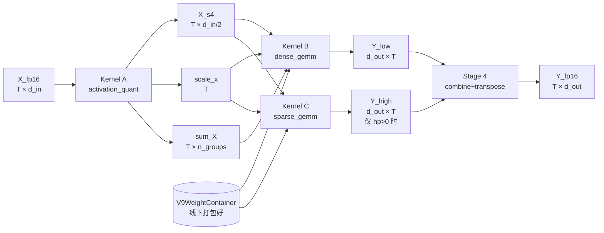

# V9 Kernel 代码架构讲解（Human Guide）

> 读者画像：你在**做 kernel 优化**（读 Triton IR、看 ncu profile、调 autotune）。
> 本文的作用是让你**快速建立整条 pipeline 的心智模型 + 每个 kernel 的性能形态 + 下次改哪里**。
> 不涉及的算法数学细节/精确 shape 契约，用附录承接。
>
> 配套文档：
> - **本文配套技术附录** → [`code_architecture_appendix.md`](./code_architecture_appendix.md)（精确 shape contract、autotune 当前配置、ncu/nsys 怎么跑、扩展时改哪些文件）
> - 算法原理 → [`kernel_algorithm.md`](./kernel_algorithm.md)
> - Triton 代码逐段注解 → [`v9_triton_implementation.md`](./v9_triton_implementation.md)
> - 优化历史与数据 → [`optimization_report.md`](./optimization_report.md)
> - 下一步优化路线与瓶颈归因 → [`analysis_20260422_next_steps.md`](./analysis_20260422_next_steps.md)

---

## 1. 这个项目在做什么？一句话版本

**把一个 FP16 的 `nn.Linear`，替换成一个"W 是 4-bit、A 是 4-bit"的等价算子，跑得比 cuBLAS FP16 快/省显存，同时精度基本不掉。**

用户视角的 API 就一行：

```python
from kernel.triton_kernel import v9_linear_forward
Y = v9_linear_forward(X_fp16, W)   # W 是预打包过的 V9WeightContainer
```

- 输入 `X_fp16`：FP16 激活，`(batch, seq, d_in)` 或 `(T, d_in)`
- 权重 `W`：`V9WeightContainer`，线下（offline）通过 GPTQ 的量化结果打包而成
- 输出 `Y`：FP16，`(batch, seq, d_out)` 或 `(T, d_out)`，和原生 `nn.Linear` 保持一致

---

## 2. 代码目录结构（只看需要关心的部分）

```
kernel/
├── research/                      ← 你在这里。文档与实验分析都在这里
│   ├── code_architecture.md       ← 本文
│   ├── kernel_algorithm.md        ← 数学原理
│   ├── v9_triton_implementation.md
│   ├── optimization_report.md     ← 做了哪些优化、各带来多少加速
│   ├── analysis_20260422_next_steps.md
│   └── tools/                     ← 分析脚本（读 sweep csv 做 bottleneck）
│
├── triton_kernel/                 ← 真正的 kernel 实现（6 个源文件）
│   ├── __init__.py                ← 对外 import 入口
│   ├── v9_linear.py               ⭐ 主入口：dispatcher + 高层 forward
│   ├── activation_quant.py        ← Kernel A：X 在线量化
│   ├── dense_u4s4_gemm.py         ← Kernel B：主 GEMM（低比特）
│   ├── sparse_s4s4_gemm.py        ← Kernel C：高精度补偿分支
│   ├── dequant_w4_to_fp16.py      ← Kernel D：W→FP16 反量化（给 cuBLAS 用）
│   ├── pack_utils.py              ← 线下权重打包 + 数据容器
│   ├── benchmarks/                ← 性能测试脚本 + 结果（results/）
│   └── tests/                     ← 正确性测试（7 个 pytest 文件）
```

> **只需记住一件事**：入口是 `v9_linear.py` 里的 `v9_linear_forward`。其他文件都是它调用的 kernel。

---

## 3. 核心思路：为什么能比 FP16 快？

原生 Linear 做的是：`Y[t, m] = Σ_k X[t, k] * W[m, k]`

- `X` 是 FP16，`W` 是 FP16 → HBM 搬运量 = `2 * d_in * d_out` 字节
- 占用 Tensor Core 的 FP16 管线

V9 Linear 的思路：**能不能把两个操作数都降到 4-bit？**

- `W` 线下压到 4-bit → HBM 搬运量 **降到 1/4**
- `X` 在线压到 4-bit → 用 int4 的 Tensor Core 管线（RTX 4090 / H100 都支持）
- 乘加结果是 int32，乘一个 scale 再转回 FP16

但 4-bit 精度不够怎么办？→ **混合精度补偿**

```
W_原始_fp16  =  W_low (4-bit, 主干, 稠密)   +   16 × W_high (4-bit, 稀疏, ~1% 的块)
                 ↑                               ↑
                 dense_u4s4_gemm 处理            sparse_s4s4_gemm 处理
                 (Kernel B)                     (Kernel C)
```

- 绝大部分位置只用 4-bit 权重（`W_low`）
- 少数"特别重要"的 128×128 块，额外存一份 `W_high`（也是 4-bit），加权 16 后叠加进来
- `W_high` 是稀疏的（只有约 1% 的块存在），所以几乎不增加带宽

这就是 **"True-Quant with sparse HP blocks"** 的核心。

---

## 4. 一次 forward 到底发生了什么？（4 段式 pipeline）

下面以 `X_fp16` shape `(T, d_in)` 输入为例，`T = batch * seq`：



### 阶段 1：激活量化（`activation_quant.py`，Kernel A）

把 `X_fp16` 每一行（每个 token）独立做 **对称 SINT4 量化**：

- 找行最大 abs 值 → `scale_x = max/7`
- 每个元素 `q = clamp(round(x/scale), -8, 7)`
- 两个 q 压一个 byte（低 4 位 + 高 4 位）→ `X_s4` 尺寸是 `T × (d_in/2)` int8
- 同时按组（每 128 列一组）算出 `sum_X`（后面修正 zero-point 用）

> 一个 kernel 一次过完成：找 max / 量化 / 打包 / 算 sum。省掉 3 次 HBM 往返。

### 阶段 2：Dense GEMM（`dense_u4s4_gemm.py`，Kernel B）

这是**主算力**。int4 × int4 的 matmul，结果 int32，再做反量化到 FP16：

```
for each tile (BM × BN):
    for k_block in groups:
        读 W_low[BM × 128] (int4 packed)
        读 X_s4[BN × 128]  (int4 packed)
        tl.dot → int32 累加
        乘以本组的 scale_w × scale_x，加 zero-point 修正 → 累加到 fp32 acc
    写 Y_low[BM × BN] 到 (d_out, T) 的位置
```

关键细节：
- **一次 K-tile 就是一个 group**（`BK=128=BCOL`）→ 每个 tile 内只做一次反量化，避免内层 loop 反复乘 scale。
- **GROUP_SIZE_M swizzle**：把相邻 M-行的 program 调度在一起，这样 W-tile 在 L2 里热，带宽复用好。
- 输出是 `(d_out, T)` 而不是 `(T, d_out)`，因为这样 store 才能 coalesce（贴合 dense GEMM 的 N-tile 方向）。阶段 4 再转置回来。

### 阶段 3：Sparse GEMM（`sparse_s4s4_gemm.py`，Kernel C）

**只在有 HP blocks 时调用**（`W.n_hp_blocks > 0`）。否则整个阶段跳过。

- 权重用 **BSR 格式**存（类似 CSR 但以 128×128 块为单位）：
  - `hp_row_offsets`（`nrow+1` 项）：每个块行对应的 HP block 起止
  - `hp_col_indices`（`n_hp_blocks` 项）：每个 HP block 的列块号
  - `W_high_blocks_packed`：`(n_hp_blocks, 128, 64) int8`，每块的 int4 数据
- 每个 Triton program 负责一个输出 tile `(BM × BN)`，扫描自己所在块行的 HP blocks 累加。
- **没有 atomic，没有 scatter**：每个输出点只被一个 program 写。

最后输出 `Y_high` 尺寸也是 `(d_out, T)` fp16。

### 阶段 4：Combine + Transpose

两步：`Y = Y_low + 16 * Y_high`，然后 `.transpose(0,1).contiguous()` 得到 `(T, d_out)`。

朴素写法会读写整块 `(d_out, T)` 内存两次。我们有一个 **融合 kernel**：单次扫描就完成加法+转置。

**但要注意**：融合 kernel 有固定 ~55μs 启动开销。surface 小于 ~4M 元素（8 MiB fp16）时反而 torch native 更快。所以在 `_combine_transpose` 里做了一次判断：
- 小规模（decode）→ 走 torch 原生 `.add_().transpose().contiguous()`
- 大规模（prefill）→ 走融合 Triton kernel

这是个典型的"不是 kernel 越多越快"的例子，可以参考 [[memory:bmmiahpl]] 我们测量微 kernel 延迟的方式。

---

## 5. 主入口：dispatcher 的两条路（`v9_linear.py`）

真正的入口是：

```python
def v9_linear_forward(X_fp16, W):
    T = X_fp16.numel() // d_in
    if T <= DECODE_T_THRESHOLD:      # 128
        return _v9_forward_decode(...)
    else:
        return _v9_forward_prefill(...)
```

为什么要分两条路？因为 **decode 和 prefill 是两种性质完全不同的场景**：

| 维度 | Decode（T ≤ 128） | Prefill（T > 128） |
|---|---|---|
| 典型场景 | 生成阶段，每次 1-128 token | 首 token prompt，512-8192 token |
| 瓶颈 | **Kernel 启动开销**主导（quant 占 33-44%, sparse 占 25-27%） | **Tensor Core 占用率**主导（dense 占 83-91%） |
| HBM 带宽利用 | dense 已经逼近 HBM roof（73%） | 仅 1.6-7%，TC 用不满 |
| 当前 speedup | 0.47-0.69× FP16 | 0.66-0.73× FP16 |
| 优化方向 | CUDA Graph 消启动开销 | Split-K / 更大 tile / W4A16 fallback |

**关键创新：Prefill 路径的 W4A16 fallback**

在 prefill 路径里有个分支：

```python
use_w4a16 = (
    W.n_hp_blocks == 0                         # 只有纯低比特权重才走
    and (T >= 1024
         or (T >= 512 and d_out*d_in <= 4096*4096))
)
if use_w4a16:
    W_fp16 = dequant_u4_to_fp16(W)             # Kernel D：一次反量化到 fp16
    X_perm = X_2d.index_select(1, W.perm)
    return torch.nn.functional.linear(X_perm, W_fp16)   # 直接交给 cuBLAS
```

为什么？——因为我们发现 prefill 时自己写的 int4 GEMM 干不过 cuBLAS FP16（TC 占用率太低）。那干脆**线上把 W 反量化出来，让专业的 cuBLAS 来跑**。

能赢的原因是：
1. 反量化只做一次（不像原始 PyTorch reference 要 `repeat_interleave` 搞 2ms，我们的 Triton kernel 只要 0.05-0.35ms）
2. T 足够大时 GEMM 本身的耗时远超反量化开销
3. 实测收益：4096×4096 shape 在 bs=2048 时快 21%，bs=8192 时快 22%

这个 fallback 是 **Phase B-2** 的重要成果（见 `optimization_report.md`）。

---

## 6. 权重容器：`V9WeightContainer`（`pack_utils.py`）

所有 kernel 消费的权重都封装在这个 dataclass 里，线下通过 `pack_v9_weights(gptq_outputs)` 构造一次：

| 字段 | 形状 | 含义 |
|---|---|---|
| `W_low_packed` | `(d_out, d_in/2) int8` | 4-bit 主权重，按 little-endian 每 byte 打 2 个 |
| `W_high_blocks_packed` | `(n_hp, 128, 64) int8` | 稀疏补偿块（可能是 0 个） |
| `scale_u4` | `(d_out, n_groups) fp16` | 每行每组一个 scale |
| `zero_u4` | `(d_out, n_groups) fp16` | 已经预减 8（MMA 用 SINT4） |
| `hp_row_offsets` | `(nrow+1,) int32` | BSR indptr |
| `hp_col_indices` | `(n_hp,) int32` | BSR 列索引 |
| `perm` | `(d_in,) int32` | GPTQ act-order 的列重排 |
| `d_out, d_in, block_shape` | 标量 | 形状元数据 |

几个关键"预计算"：
- **UINT4 → SINT4 的 -8 偏移线下完成**：线上 MMA 就不用再做 offset。
- **BSR 排序 + indptr 建好**：线上直接顺序扫。
- **Pack 后送上 GPU**：线上 0 次 CPU-GPU 搬运。

> 打包是一次性的，算法侧给的就是 GPTQ 的输出 dict，调一次 `pack_v9_weights` 就搞定。

---

## 7. 4 个 Triton Kernel 的"优化者视角"卡片

> 每张卡片包含：**这个 kernel 做什么 / 当前形态 / 下一个调 bottleneck 该看哪 / 改的时候要一起改的地方**。
> 精确的 autotune 配置表、shape contract、ncu 命令都在附录 §A-§D；**深度优化 Playbook** 在附录 §J-§M：
> - §J Dequant PTX `prmt.b32` 展开指南（Kernel B 的 1.27x → 1.0x 核心路径）
> - §K 4090 SMEM budget 推导（解释 autotune 为什么止步 256×256）
> - §L W4A16 fallback 阈值调参 playbook（跨卡迁移必读）
> - §M CUDA Graph 接入 decode 的完整步骤（Kernel A 的 launch overhead 杀手）

---

### 🟦 Kernel A：`activation_quant_kernel`（`activation_quant.py`）

**做什么**：`X_fp16: (T, d_in)` → `X_s4: (T, d_in/2) int8` + `scale_x: (T,)` + `sum_X: (T, n_groups) int32`
- 每行 per-token 对称 SINT4 量化（range `[-7, 7]`，dead 了 `-8`）
- 融合：find-max / quantize / u4-pack / per-group sum → 一个 kernel 一次过

**tile 轴**：`BT`（沿 token）× `BD`（沿 d_in）；autotune 11 个 config，跨越 `BT∈{16,32,64,128}, BD∈{256,512,1024,2048}`。

**典型时间占比**：
| 场景 | 占 v9_total |
|---|---|
| decode (T≤16) | **33–44%** ⚠️ |
| small (T=32–64) | 33–42% |
| mid / prefill | 5–16% |

**瓶颈形态**：
- **decode**：不是算力瓶颈，是 **kernel launch overhead + autotune dispatch**。`BT=16, BD=256, warps=2` 只要 tile 本身 ~3μs，但 launch 固定 ~5μs，这就决定了 decode 摊不掉。
- **prefill**：HBM bound。当前 bandwidth 利用率约 55–70% of peak（可以拉满）。

**下次改它时要看的**：
1. `triton-dejavu` autotune 缓存文件（第一次 T 命中新配置要重编）。
2. `ncu --section MemoryWorkloadAnalysis` 看 `dram__bytes_read.sum.per_second`，判断是否触顶。
3. **kernel 本身已经 4 路融合**，不要再加 stage；继续优化只有两条路：
   - **tile shape 专门化**（让 dispatcher 按 T 预选 config；见附录 §C.2 当前网格）
   - **CUDA Graph 摊薄 launch**：完整接入步骤见 [附录 §M](./code_architecture_appendix.md#m-cuda-graph-接入-decode-path-的具体步骤)（含 `V9DecodeGraphRunner` 完整代码 + bench 脚本 + nsys 验证）

**改它时必须一起改的**：`dense_u4s4_gemm.py` 里读 `X_s4, sum_X` 的 stride / dtype 必须保持一致；目前契约是 `int8 row-major, 每 byte 低 4 位存列偶, 高 4 位存列奇`。

---

### 🟩 Kernel B：`dense_gemm_kernel`（`dense_u4s4_gemm.py`）⭐ 主算力

**做什么**：`W_low_s4 @ X_s4^T → Y_low: (d_out, T) fp16`，用 int4×int4 TC + 组内反量化。

**tile 轴**：`BM × BN × BK`（M=d_out, N=T, K=d_in）；当前 15 个 config，含 `GROUP_SIZE_M` swizzle（1/4/8/16）。
- **K 维度强约束**：`BK = BCOL = 128`（一组 scale 对应一个 K-tile），不要动。

**典型时间占比**：
| 场景 | 占 v9_total | dense/fp16 比 |
|---|---|---|
| decode (T≤16) | 37–49% | **0.73x（HBM-bound, 快）** |
| mid (T=128–512) | 37–70% | **1.21x（TC 用不满）** |
| prefill (T≥2K) | **83–91%** ⚠️ | **1.27x（TC 用不满）** |

**瓶颈形态（这是当前最重要的 kernel）**：
- **decode**：已经触 HBM roof（`bs=1, d_out=28672` 实测 741 GB/s = 73% of 4090 peak 1008 GB/s）→ 再优化空间只剩**"别浪费带宽在无效 load"**（dequant 延迟、scale/zero broadcast）。
- **prefill**：**tensor core 占用率不足**。dense/fp16=1.27x 的根源是 4-bit load + 软件 unpack 把 TC 喂不饱。ncu 上 `sm__pipe_tensor_op_hmma_cycles_active.avg.pct_of_peak_sustained_elapsed` 估计 <30%。
- **已经上线的 prefill fallback**：大 T + 纯 dense 时走 W4A16（反量化 + cuBLAS），见 §5。

**下次改它时要看的**（按 ROI 排序）：
1. **Dequant 走 PTX `prmt.b32`** ★ 最高 ROI。入口在 `dense_u4s4_gemm.py` L31 的 `_unpack_packed_s4_rowmajor`。完整 IR / SASS 分析、`tl.inline_asm_elementwise` 写法、预期收益（30% → 50% TC 占用率）、验证步骤全部在 [附录 §J](./code_architecture_appendix.md#j-dequant-在-triton-ir--sass-上发生了什么)。
2. **Autotune 扩 tile**：在加新 config 前先读 [附录 §K](./code_architecture_appendix.md#k-4090-shared-memory-budget-推导)——SMEM budget 告诉你 `256×256×stages=3` 已经是 4090 硬上限；**安全扩展方向是 `BM=256, BN=128, stages=3`（甜点）**。
3. **Split-K**：对 prefill `bs=2K–8K` K=14336 很长，当前 K-loop 单 program 承担，可以沿 K 切成 2–4 段用 atomic 累加（加 `SPLIT_K` constexpr + 新 launcher；首次 atomic_add 前要 `Y_low.zero_()`）。
4. **Epilogue 融合 combine+transpose**：当前 Stage 4 还在 kernel 外做；理想态是 dense kernel 直接按 `(T, d_out)` 输出。改动链路长：dense 和 sparse 输出布局都要改 → pack_utils 预转置要去 → `_v9_forward_*` 结构重写。
5. `ncu --section SpeedOfLight` 看 TC vs DRAM vs Compute 三角图；关注 `sm__pipe_tensor_op_hmma_cycles_active.avg.pct_of_peak_sustained_elapsed`（目标 >50%）。

**改它时必须一起改的**：
- `pack_utils.py` 的 `W_low_packed` layout / scale / zero / `perm`；任何 layout 变化都要更新 `pack_v9_weights`。
- `v9_linear.py` 的 `_v9_forward_prefill` / `_v9_forward_decode` 里对 `Y_low` shape 的预期。
- `tests/test_dense.py` 和 `tests/test_end2end.py` 的 ref path。

---

### 🟨 Kernel C：`sparse_gemm_kernel`（`sparse_s4s4_gemm.py`）

**做什么**：BSR 稀疏 `W_high @ X_s4^T → Y_high: (d_out, T) fp16`，只在 `n_hp_blocks > 0` 才跑。

**tile 轴**：`BM × BN`（K 在 kernel 内沿 block 扫）；当前仅 3 个 config——**显著欠 autotune**。

**典型时间占比**：
| 场景 | 占 v9_total |
|---|---|
| decode hp>0 | **25–27%** ⚠️ |
| small hp>0 | 25% |
| prefill hp>0 | 7% |

**瓶颈形态**：
- **decode hp>0 是第二大 bottleneck**（仅次于 dense）。
- 根因：tile 配置太粗（`BM=128, BN=128`），但 decode 时 N=T 只有 1–16，**99% 的 tile 空转**（掩码写全 0）。
- autotune 只有 3 个 config，没有 `BN=16/32` 的小 tile。
- 每个 BSR 块行的 HP blocks 数是非均匀的，程序之间 load imbalance 明显（没做）。

**下次改它时要看的**：
1. 加 decode 专用 config：`BM=64, BN=16, num_warps=2, num_stages=2`（mimic dense 的 decode tier；SMEM 预算参考 [附录 §K.2](./code_architecture_appendix.md#k2-dense-kernel-的-smem-账单)）。
2. **考虑和 dense 融合到同一 kernel**：都写同一块 `Y (d_out, T)` 输出，节省一次 kernel launch（~5μs）+ 输出 HBM 读写。
3. **Combine 在 sparse kernel 内完成**：sparse 直接 atomic_add 16× result 到 `Y_out: (T, d_out)` 的最终位置，stage 4 可以只做 transpose 而不做 add（对应已有 `HAS_HIGH=False` 路径）。
4. `ncu` 看 `inst_executed_pred_on`：如果 predicated-off 比例高，说明 tile 太大。

**改它时必须一起改的**：
- `pack_utils.py` 的 BSR 布局：`hp_row_offsets`、`hp_col_indices`、`W_high_blocks_packed`。
- `v9_linear.py` 里 `W.n_hp_blocks == 0` 的 early skip 判断。
- `tests/test_sparse.py` 的稀疏度 sweep。

---

### 🟥 Kernel D：`_dequant_u4_to_fp16_kernel`（`dequant_w4_to_fp16.py`）

**做什么**：`W_low_packed: (d_out, d_in/2) int8 + scale + zero → W: (d_out, d_in) fp16`，把 4-bit 权重反量化成 fp16 矩阵，**喂给 cuBLAS**。

**tile 轴**：`BM × BK`（M=d_out, K=d_in）；6 个 config。

**典型时间占比**：**只在 prefill W4A16 fallback 路径里出现**。测过 4096×4096 一次 ~0.05ms, 28672×4096 ~0.35ms。比 torch `repeat_interleave` 的 2ms 快 38–46x。

**瓶颈形态**：
- 纯 HBM-bound：读 `d_in × d_out / 2` bytes，写 `2 × d_in × d_out` bytes（fp16）。写比读多 4 倍 → **写带宽决定上限**。
- 当前带宽利用率估计 ~60% peak。

**下次改它时要看的**：
1. 这个 kernel 的优化 ROI 不高——fallback 路径里 GEMM 本身 >1ms，dequant 只占 5–10%。
2. 如果要进一步加速 fallback，方向是**在 fallback 里改用 W4A8 / W8A8 GEMM**（不再反量化到 fp16），但这是个大重构。
3. **换卡时必重调 fallback 阈值** `use_w4a16`（`v9_linear.py` L295-302）——完整调参 playbook 见 [附录 §L](./code_architecture_appendix.md#l-w4a16-fallback-阈值调参方法)（含交叉点理论推导 + 实验采集命令 + per-shape 查表方案 + H100/A100/L40S 迁移要点）。

**改它时必须一起改的**：
- `v9_linear.py` 的 `dequant_w_to_fp16()` adapter。
- `tests/test_w4a16_fallback.py` 的精度契约。

---

### 🟪 Kernel E：`_combine_transpose_kernel`（`v9_linear.py`）

**做什么**：`Y_low, Y_high: (d_out, T) fp16 → Y: (T, d_out) fp16`，融合 `add_(alpha=16) + transpose.contiguous()`。

**tile 轴**：`BT × BD`；5 个 config。

**瓶颈形态**：
- 启动 + autotune dispatch 开销固定 ~55–65μs（这是个微 kernel，overhead 占比大）。
- 对于 `T × d_out ≤ 4M` elements（8MB fp16），torch native transpose_contiguous 更快（3-5x），所以代码里有 `SMALL_SURFACE = 4 * 1024 * 1024` 的 fallback。
- `HAS_HIGH` 是 `constexpr`，`hp=0` 时第二个 load 被编译掉，不浪费带宽。

**下次改它时要看的**：
1. **理想态是消灭这个 kernel**：dense kernel 的 epilogue 直接写 `(T, d_out)` 并做 `+16 × Y_high`。但需要先把 dense 的输出布局从 `(d_out, T)` 翻过来，改动链路较长。
2. 如果保留，尽量提高 `SMALL_SURFACE` 阈值覆盖的 decode 区段（避免 triton 被错选）。

**改它时必须一起改的**：
- 如果消灭它 → dense 和 sparse 两个 kernel 的输出布局都要改 → pack_utils 的预 transpose 不再需要 → `_v9_forward_*` 的 stage 结构需要重写。

---

## 8. 典型工作场景的入口速查

### 场景 A：端到端 forward（模型集成 / 回归测试）

```python
from kernel.triton_kernel import pack_v9_weights, v9_linear_forward
W = pack_v9_weights(gptq_outputs_dict)        # 离线一次
Y = v9_linear_forward(X_fp16, W)              # 自动走 decode / prefill
```

### 场景 B：锁定 decode / prefill（剖析某一条路的性能）

```python
from kernel.triton_kernel.v9_linear import (
    v9_linear_forward_decode, v9_linear_forward_prefill,
)
Y = v9_linear_forward_decode(X_fp16, W)       # 跳过 dispatcher
Y = v9_linear_forward_prefill(X_fp16, W)      # 强制 prefill 路径
```

### 场景 C：精度验证（改 kernel 前后必跑）

```python
from kernel.triton_kernel.v9_linear import v9_linear_fakequant
Y_ref = v9_linear_fakequant(X_fp16, W)        # 纯 PyTorch 参考实现
Y     = v9_linear_forward(X_fp16, W)          # 实际 kernel
# rtol 1e-3 是默认契约；test_end2end.py 里有完整对照
```

### 场景 D：只跑单个 kernel 的微基准（看某次改动的绝对影响）

```bash
# Dense 单 kernel vs cuBLAS FP16 (per-shape)
python -m triton_kernel.benchmarks.bench_dense

# Dispatcher overhead（确认 T 判断本身不是瓶颈）
python -m triton_kernel.benchmarks.bench_dispatcher_overhead

# Phase B-1 autotune 对比（跑完会写 results/phase_b1_*.csv）
python -m triton_kernel.benchmarks.bench_phase_b1_compare
```

### 场景 E：一次跑完 7×6×4 的全 sweep（提交 PR 前的 golden run）

```bash
python -m triton_kernel.benchmarks.sweep_v9
# 输出到 results/sweep_<timestamp>.{csv,md,log}
# 再用分析工具归因：
python -m research.tools.analyze_sweep_bottleneck results/sweep_<ts>.csv
```

### 场景 F：Nsight 结构化分析（看 kernel 占比 / launch 时间线）

```bash
bash triton_kernel/benchmarks/run_nsys_sweep.sh      # 采样 decode/mid/prefill 4 种 workload
python triton_kernel/benchmarks/summarize_nsys.py    # 汇总成 nsys_summary_<ts>.md
```

> 📌 GPU 微基准规范 [[memory:bmmiahpl]]：**不要**用 nsys/ncu 做主计时器，CUPTI hook 会给微 kernel 正向污染；用 `_bench_util.py` 的 50 warmup + 3×100 iter + min-of-means 做绝对计时，nsys 只用于结构化分析。

---

## 9. 按"优化目标"查要动哪些文件

这一节给你一个 **"想改这件事 → 要动这些文件 + 这些测试"** 的查找表：

| 你想做的事 | 必改文件 | 必看/加测试 | 关键契约 |
|---|---|---|---|
| **调 dense autotune tile** | `dense_u4s4_gemm.py`（仅 autotune 列表） | `tests/test_dense.py`, `bench_dense.py` | `BK=128` 不可改；`BM*BN` 不能超 shared mem |
| **加 dense Split-K** | `dense_u4s4_gemm.py`（加 `SPLIT_K` constexpr + atomic epilogue），`v9_linear.py`（launcher grid） | `test_dense.py` 加非整除 K 的 shape | 首次 atomic_add 需要 `Y_low.zero_()` |
| **换 dequant 方法（PTX prmt）** | `dense_u4s4_gemm.py`（unpack 部分） | `test_dense.py` 对所有 dtype/shape | Packed layout `low @ bit[0:4], high @ bit[4:8]` 锁定 |
| **融合 combine 进 dense epilogue** | `dense_u4s4_gemm.py`（epilogue），`v9_linear.py`（删 stage 4），`pack_utils.py`（改 scale/zero 布局？） | `test_end2end.py` 重跑 | dense 输出从 `(d_out, T)` → `(T, d_out)`；sparse 要一起改 |
| **稀疏 decode 专用 tile** | `sparse_s4s4_gemm.py`（加 `BN=16/32` config） | `test_sparse.py`, `bench_sparse.py` | BSR indptr/indices 布局不变 |
| **Dense + Sparse 融合一次 launch** | 新建 `fused_dense_sparse.py`，`v9_linear.py` 分支 | 新建 `test_fused.py` | 两者输出契约一致 `(d_out, T)` |
| **Quant + Dense 融合** | 激进重构；不推荐 | — | X_s4 / sum_X 要在 SRAM 里传递 |
| **CUDA Graph decode** | `v9_linear.py`（加 `v9_linear_forward_decode_graph`） | 新建 `test_cuda_graph.py` | T 必须固定；权重地址固定 |
| **调整 W4A16 fallback 阈值** | `v9_linear.py`（`_v9_forward_prefill` 内的 `use_w4a16` 条件） | 重跑 `sweep_v9` | 阈值随卡会变；4090 上 T≥1024 是甜点 |
| **支持新卡（如 H100/L40S）** | 所有 autotune 列表（shared mem / TC pipe 差异） | 重跑 sweep | TMA 可用后 dense / dequant 都要重写 |
| **接入非 GPTQ 的量化流程** | `pack_utils.py`（`pack_v9_weights` 输入适配） | `test_pack_utils.py` | 七个输入 key 的 schema 见附录 §B |

---

## 10. 心智模型回顾 + 下次改代码的"打开顺序"

心智模型 6 条：

1. API 入口 `v9_linear_forward(X, W)`；dispatcher 基于 `T ≤ 128` 分流 decode / prefill。
2. 权重 `V9WeightContainer` 线下打包一次；线上零拷贝。
3. Forward 4 段：quant → dense_gemm → (opt) sparse_gemm → combine+transpose。
4. 当前主要 bottleneck：
   - Decode：**Kernel launch overhead + sparse tile 过粗**
   - Prefill：**Dense TC 占用率不足**（W4A16 fallback 已部分解决）
5. 所有 kernel 用 `@triton.autotune`；**Split-K / dequant PTX / epilogue 融合**是接下来三大手段。
6. 微基准规范 [[memory:bmmiahpl]]：50 warmup + 3×100 iter + min-of-means；nsys 只做结构化。

下次要动 kernel 时，建议的**打开顺序**：

1. **先看** [`analysis_20260422_next_steps.md`](./analysis_20260422_next_steps.md) 的"下一步路线"段落——知道该动哪个方向。
2. **再看** [`optimization_report.md`](./optimization_report.md) 的最新 sweep 段落——确认基线数据还符合当前代码。
3. **对照** 本文 §7 的卡片找到要动的 kernel。
4. **查契约**：[附录 §B](./code_architecture_appendix.md#b-数据结构契约)（shape contract）+ [§C](./code_architecture_appendix.md#c-当前-autotune-网格快照commit-参考main)（autotune 网格）。
5. **查优化手册**（四选一，按你选的方向进）：
   - 改 dequant / 追 TC 占用率 → [§J](./code_architecture_appendix.md#j-dequant-在-triton-ir--sass-上发生了什么)
   - 加新 autotune config → [§K](./code_architecture_appendix.md#k-4090-shared-memory-budget-推导) 先算 SMEM
   - 调 W4A16 阈值 → [§L](./code_architecture_appendix.md#l-w4a16-fallback-阈值调参方法)
   - 想消除 decode launch overhead → [§M](./code_architecture_appendix.md#m-cuda-graph-接入-decode-path-的具体步骤)
6. **动完** 按 §9 清单补测试 + 跑 `sweep_v9` + `analyze_sweep_bottleneck`。
7. **提交** 按 commit 规范（见[附录 §E](./code_architecture_appendix.md#e-commit--pr-规范)）写 message。

---

## 附：相关文件一键跳转

- 主入口：[`v9_linear.py`](../triton_kernel/v9_linear.py)
- 权重容器：[`pack_utils.py`](../triton_kernel/pack_utils.py)
- 4 个 kernel：
  - [`activation_quant.py`](../triton_kernel/activation_quant.py)
  - [`dense_u4s4_gemm.py`](../triton_kernel/dense_u4s4_gemm.py)
  - [`sparse_s4s4_gemm.py`](../triton_kernel/sparse_s4s4_gemm.py)
  - [`dequant_w4_to_fp16.py`](../triton_kernel/dequant_w4_to_fp16.py)
- 正确性测试：[`tests/`](../triton_kernel/tests/)
- 性能测试：[`benchmarks/`](../triton_kernel/benchmarks/)
- **技术附录（精确契约、配置、命令）** → [`code_architecture_appendix.md`](./code_architecture_appendix.md)
