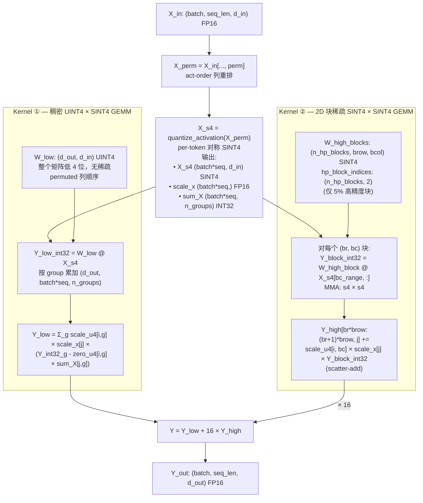

# V9 推理 Kernel — True Quant 算法逻辑分析

> **文档类型**：Kernel 算法逻辑分析（仅分析正确性，不含代码实现）
> **目标硬件**：NVIDIA RTX 4090 (SM89, Ada Lovelace)
> **前置文档**：[model.md](./model.md) — 量化方案与训练时逻辑
> **对应量化代码**：[gptq_submatrix_mixed.py](../../Zip/qwen3_gptq_repro/gptq_submatrix_mixed.py)
> **日期**：2026-04-20
> **状态**：逻辑分析阶段 — 确认正确性后再进入实现

---

## 0. 文档范围与核心设定

本文档**只讨论 True Quant**（真实整数推理）的情况，不讨论 FakeQuant（浮点模拟量化）。

### 0.1 量化总览

V9 是**子矩阵（block）粒度混合精度 GPTQ**：
- 权重矩阵按 `(brow, bcol)` 网格划分成子矩阵块（默认 `(128, 128)`）
- **95% 的块** 做 UINT4 量化（值域 `[0, 15]`，非对称，带 zero）
- **5% 的块** 做 SINT8 量化（值域 `[-128, 127]`，对称，无 zero）
- 高精度块的选择由 Phase 1 敏感度评分输出 `high_precision_mask: (nrow, ncol) bool`

### 0.2 核心设计：离线位级拆分 — 推理侧没有"INT8 数据"

**量化完成后，立刻把所有 SINT8 值按位拆成 UINT4 低位 + SINT4 高位**，之后的离线打包和在线推理都不再保留 SINT8 形态：

```
对每个 SINT8 值 v ∈ [-128, 127]:

    v = v_high × 16 + v_low

    v_low  = v & 0x0F        ∈ [0, 15]     (UINT4)
    v_high = v >> 4          ∈ [-8, 7]     (SINT4，算术右移)
```

这是**逐位精确**的无损分解。于是整块权重矩阵重新组织成两层：

| 层 | 数据类型 | 覆盖范围 | 稀疏模式 |
|----|---------|---------|---------|
| **稠密低位层 `W_low`** | UINT4 | **整个 `(d_out, d_in)`** — 95% 块的 UINT4 量化结果 + 5% 块 SINT8 值的低 4 位，**二者无差别** | 稠密 100% |
| **稀疏高位层 `W_high`** | SINT4 | 只在 5% 高精度块位置有值（UINT4 块位置恒为 0，不存） | 2D 块稀疏 ~5% |

**关键观念**：
- 推理 kernel 眼里**不存在"SINT8 块"**。SINT8 只是量化阶段的一个中间口径（决定量化 scale 的取法）。
- 量化完成 → 位级拆分 → 打包阶段就把 "高位是 0 的位置" 丢掉，只保留稀疏的 SINT4 高位。
- **两个 GEMM kernel 都是纯 4-bit**：一个稠密 UINT4×SINT4，一个稀疏 SINT4×SINT4。

### 0.3 统一量化粒度：`(1, bcol)` per-group

**全部三条量化路径**（Phase 1 打分用的 INT4 fake-quant、Phase 2 真实写回的 UINT4、Phase 2 SINT8）的 scale 粒度**完全一致**：

```
沿 d_in 方向：每 bcol 个连续元素共享一个 scale/zero
沿 d_out 方向：每 1 行独立一个 scale/zero
```

强制 `groupsize == bcol`（`gptq_submatrix_mixed.py` 启动时若不满足会 `ValueError`）。

| 路径 | 粒度 | 对称性 | 反量化公式 | Scale 形状 |
|------|------|--------|----------|-----------|
| **低位 UINT4 层** | `(1, bcol)` per-row-per-group | 非对称 | `x = (q - zero) × scale` | `(d_out, n_groups)` |
| **高位 SINT4 层**（仅 5% 块有） | `(1, bcol)` per-row-per-group | 对称（zero=0） | `x = 16 × q × scale` | `(d_out, n_groups)` 稀疏 |
| **激活** | per-token | 对称 | `x = q × scale_x` | `(batch*seq,)` |

其中 `n_groups = ceil(d_in / bcol) = ncol`。**关键好处**：

1. 两层 scale 都是 `(d_out, n_groups)` 同形状，物理布局完全对齐——推理 kernel 可以用同一套加载逻辑。
2. **Group 边界 ≡ block_col 边界**。对固定的输出行 `i`（令 `br_i = ⌊i/brow⌋`），第 `g` 个 group 的 bcol 列**要么全部属于 UINT4 块、要么全部属于原 SINT8 块**（后者意味着"有非零高位"），由 `high_precision_mask[br_i, g]` 决定。
3. Phase 1 打分口径与 Phase 2 真实写回口径完全一致，打分无偏差。

### 0.4 三大核心技术要点

| # | 内容 | 说明 |
|---|------|------|
| 1 | **激活量化 W4A4** | X_in 量化到 SINT4（per-token 对称），匹配 4-bit Tensor Core |
| 2 | **离线位级拆分** | SINT8 → UINT4 低位（融入稠密层）+ SINT4 高位（2D 块稀疏层），推理侧无 SINT8 |
| 3 | **act-order 列排列** | 权重保持 permuted 顺序存储，推理时对 X 做相同的 perm |

**GEMM 合并公式**：`Y = Y_low + 16 × Y_high`（数值上与原始 SINT8 × SINT4 GEMM 逐位精确等价）。

---

## 1. 从量化代码到推理：GPTQ 输出了什么？

### 1.1 量化流程回顾（统一粒度下）

`fasterquant`（`actorder=True`）的核心步骤：

```
步骤 1: perm = argsort(diag(H), descending=True)
        W = W[:, perm]                          ← 按 Hessian 重要性重排列
        H = H[perm][:, perm]

步骤 2（Phase 1，permuted 空间）:
        block_scores, high_precision_mask = compute_block_sensitivity(
            W, (brow, bcol), budget_ratio, metric=...
        )
        # 内部 INT4 fake-quant 的 scale 粒度 (1, bcol)，与 Phase 2 UINT4 一致

步骤 3（Phase 2，逐列循环，强制 groupsize == bcol）:
        每进入一个新 block_col (col_idx % bcol == 0):
          · UINT4 路径：self.quantizer.find_params(W[:, col_idx:col_idx+bcol])
              得到 per-row 的 scale_u4, zero_u4（形状 (d_out, 1)，组内复用）
          · SINT8 路径：如果该 block_col 含任何 INT8 块，
              _int8_fakequant_group(W[:, col_idx:col_idx+bcol])
              得到 per-row scale_s8（形状 (d_out,)，组内复用）

        对每一列 col_idx：
          · 若 col_is_all_int4[bc]:   q = quantize(w, scale_u4, zero_u4, maxq=15)
          · 若 col_is_all_int8[bc]:   q = clamp(round(w / scale_s8), -128, 127) × scale_s8
          · 混合列（bc 内部行方向混合）：
                先走 UINT4 路径得到整列 q
                对 high_precision_mask[br, bc] = True 的行段 [r0:r1]：
                    用缓存的 scale_s8[r0:r1] 覆盖为 SINT8 反量化结果

步骤 4（位级拆分 — 这是本方案独有的后处理）:
        对每个 SINT8 量化结果 q_s8:
            q_low_u4  = q_s8 & 0x0F      ∈ [0, 15]
            q_high_s4 = q_s8 >> 4        ∈ [-8, 7]

步骤 5（invperm 还原 — 仅 FakeQuant 产物）:
        Q = Q_permuted[:, invperm]        ← True Quant 下不做这一步
```

### 1.2 GPTQ 输出 → 两层数据（位级拆分后）

```
输入 (permuted 列顺序):
  对 UINT4 块位置 (br, bc)，每个元素有一个 q_u4 ∈ [0, 15]
  对 SINT8 块位置 (br, bc)，每个元素有一个 q_s8 ∈ [-128, 127]
                            → 拆成 (q_low_u4 ∈ [0,15], q_high_s4 ∈ [-8,7])

生成两层:

  W_low (d_out, d_in) UINT4:
      · UINT4 块位置:  = q_u4
      · SINT8 块位置:  = q_s8 & 0x0F
      → 对 kernel 侧完全无差别，都是 UINT4 ∈ [0, 15]

  W_high (只在 SINT8 块位置有) SINT4:
      · SINT8 块位置:  = q_s8 >> 4   ∈ [-8, 7]
      · UINT4 块位置:  省略不存（等价于 0）
      → 2D 块稀疏，仅 5% 块有数据
```

**两层的反量化 scale 不同**：
- `W_low` 用 `scale_u4, zero_u4`（对所有位置）
- `W_high` 用 `scale_s8`（仅 5% 块对应位置有值）

### 1.3 True Quant 下的列顺序

GPTQ 的 scale/zero、`high_precision_mask`、位级拆分全部在 **permuted 列顺序**下完成。若 `invperm` 还原：
- Group 的列归属被打散，`scale_u4`/`zero_u4`/`scale_s8` 与列对应关系破坏
- `high_precision_mask` 的列坐标失效
- 2D 块稀疏结构被打乱

**结论：权重保持 permuted 顺序存储；推理时对 X 做相同的 perm。**

### 1.4 推理 kernel 总览

```
X_in: (batch, seq_len, d_in) FP16
  → X_perm = X_in[..., perm]                 ← 对输入做列重排
  → X_s4  = quantize_activation(X_perm)      ← 激活量化到 SINT4（per-token 对称）
  → Y     = (W_low 反量化贡献) + 16 × (W_high 反量化贡献)
        · Kernel ①：稠密 UINT4 × SINT4 GEMM  （整个 d_out × d_in，带 UINT4 dequant + zero 项）
        · Kernel ②：2D 块稀疏 SINT4 × SINT4 GEMM  （仅 5% 块，高位）
```

---

## 2. 激活量化：从 W4A16 到 W4A4

### 2.1 为什么需要 W4A4

在 RTX 4090 上：
- W4A16 GEMM：权重 INT4，激活 FP16，kernel 内需 dequant 后用 FP16 Tensor Core
- W4A4 GEMM：权重 INT4，激活 INT4，可直接用 INT4 Tensor Core 或 INT8 Tensor Core 模拟

**W4A4 的优势**：激活带宽减半（INT4 vs FP16），利用整数 Tensor Core 的更高吞吐。
**W4A4 的代价**：激活量化引入额外误差；推理时需在线量化激活。

### 2.2 激活量化方案

激活 X 采用 **per-token 对称 SINT4**（值域 `[-8, 7]`）：

```
对于每个 token t:
  scale_x[t]  = max(|X[t, :]|) / 7        (对称，无 zero)
  X_s4[t, :]  = clamp(round(X[t, :] / scale_x[t]), -8, 7)
```

**为什么激活用 SINT4 而不是 UINT4？**
- 激活分布以 0 为中心（LayerNorm 之后更明显），对称量化更自然
- 直接匹配 `u4 × s4` MMA（Ada Tensor Core 的原生混合符号支持）

### 2.3 激活阶段的辅助预计算：`sum_X`

为了处理 UINT4 的 zero 项，激活量化 kernel 顺手输出：

```
sum_X[j, g] = Σ_{k ∈ group g} X_s4[k, j]       (INT32)
```

形状 `(batch*seq, n_groups)`。

**在统一粒度下的关键简化**：group 边界 = block_col 边界，**同一个 group g 的 bcol 列归属同一种块类型**（由 `high_precision_mask[br_i, g]` 决定）。因此 UINT4 反量化里的"每个 group 内需要 `Σ X_s4[k, j]`"直接就是 `sum_X[j, g]`，不需要 per-block 细分修正。

### 2.4 GEMM 反量化公式（两层结构）

对输出行 `i`（`br_i = ⌊i/brow⌋`）、token `j`：

**稠密低位层（UINT4，所有位置都有贡献）**：

```
Y_low[i, j] = Σ_g scale_u4[i, g] × scale_x[j] × (
                  Σ_{k ∈ group g} W_low[i, k] × X_s4[k, j]
                - zero_u4[i, g] × sum_X[j, g]
              )
```

**稀疏高位层（SINT4，仅 5% 块）**：

```
Y_high[i, j] = Σ_{g : high_precision_mask[br_i, g] = T}
                  scale_s8[i, g] × scale_x[j] × (
                      Σ_{k ∈ group g} W_s8[i, k] × X_s4[k, j]
                  )
```

**最终输出**：

```
Y[i, j] = Y_low[i, j] + 16 × Y_high[i, j]
```

**重要**：因为 SINT8 块的低 4 位已经作为 UINT4 融入 `W_low`，**Kernel ① 在 SINT8 块位置也会产生累加**——这些累加恰好就是 SINT8 值的低 4 位贡献，由 `scale_u4, zero_u4` 反量化。`scale_u4, zero_u4` 在 SINT8 块的 group 位置**也需要定义**（见 §2.5）。

### 2.5 SINT8 块位置的 `scale_u4, zero_u4` 如何取？

**关键问题**：对 5% 块位置，这些列的"UINT4 基线"是从哪里来的？

**答**：GPTQ Phase 2 的 UINT4 路径对**每个 block_col 都会调用 `find_params`**，产生 `(d_out, 1)` 的 `scale_u4/zero_u4`（整个 block_col 的所有行，不管该行是走 UINT4 还是走 SINT8）。当该 block_col 含有 SINT8 块时：
- **SINT8 行段**最终写入的 `W_low` 是 `q_s8 & 0x0F`（不是按 `scale_u4` 量化出来的）
- 但 `scale_u4[SINT8 行段, bc], zero_u4[SINT8 行段, bc]` 依然**被计算出来**
- 这套 `scale_u4, zero_u4` 就是 Kernel ① 对该 group 使用的反量化参数

**正确性保证**：Kernel ① 用 `(W_low - zero_u4) × scale_u4` 反量化后得到的**不是**原始权重，而是 "`q_s8` 的低 4 位对应的伪浮点值"。它本身没有独立物理意义——关键在于 Kernel ② 贡献 `16 × W_high × scale_s8`，两者相加以后**并不能精确还原原始 SINT8 权重**，因为：

```
想要:   W_s8_dequant = q_s8 × scale_s8 = (16 × q_high + q_low) × scale_s8
实际:   Y_low + 16×Y_high contribution at this (i,g):
        = (q_low - zero_u4) × scale_u4 × X_s4 × scale_x
        + 16 × q_high × scale_s8 × X_s4 × scale_x
```

两种 scale 不同！要让加法等于 `(16 × q_high + q_low) × scale_s8`，必须要求 **SINT8 块对应 group 的 `scale_u4` 与 `scale_s8` 同值、`zero_u4 = 0`**，或者用其它方式抵消 `q_low` 路径的错误 scale。

**这引出了正确性的关键修正（见 §3）**。

---

## 3. 保证数值等价的关键设计

### 3.1 问题：低位用 `scale_u4`、高位用 `scale_s8` 会数值不等价

直接按 §2.4 的公式，在 SINT8 块位置：
```
Y_contribution(i,j,g) = (q_low - zero_u4) × scale_u4 × X_s4 × scale_x
                      + 16 × q_high × scale_s8 × X_s4 × scale_x
```
而我们**想要**的是：
```
Y_target(i,j,g) = q_s8 × scale_s8 × X_s4 × scale_x
                = (16 × q_high + q_low) × scale_s8 × X_s4 × scale_x
```

两者一般不相等。**必须在打包阶段做处理**。

### 3.2 方案：SINT8 块位置的低位路径用 `scale_s8`、`zero=0`

**打包约定**：对每个 SINT8 块 `(br, bc)`，**覆盖写**该 group 的 `scale_u4, zero_u4`：

```
scale_u4[br*brow:(br+1)*brow, bc] ← scale_s8[br*brow:(br+1)*brow, bc]
zero_u4 [br*brow:(br+1)*brow, bc] ← 0
```

经过覆盖后：
- UINT4 块位置：`scale_u4 / zero_u4` 保留 GPTQ 的原始值
- SINT8 块位置：`scale_u4 = scale_s8`，`zero_u4 = 0`

此时在 SINT8 块的 group `(br, bc)`：
```
Y_contribution = (q_low - 0) × scale_s8 × X_s4 × scale_x
               + 16 × q_high × scale_s8 × X_s4 × scale_x
               = (q_low + 16 × q_high) × scale_s8 × X_s4 × scale_x
               = q_s8 × scale_s8 × X_s4 × scale_x     ✓
```

数值精确等价！**这就是本方案的核心正确性保证**。

### 3.3 两层 scale/zero 的最终形态

| 位置 | `scale_u4` | `zero_u4` | `scale_s8` | `W_low` | `W_high` |
|------|-----------|-----------|-----------|---------|---------|
| **UINT4 块**（95%） | GPTQ 的 U4 scale | GPTQ 的 U4 zero | 不存 / 0 | `q_u4` ∈ [0,15] | 不存 / 0 |
| **SINT8 块**（5%） | **等于 `scale_s8`**（覆盖） | **0**（覆盖） | GPTQ 的 S8 scale | `q_s8 & 0x0F` ∈ [0,15] | `q_s8 >> 4` ∈ [-8,7] |

- `scale_u4`：`(d_out, n_groups)`，**每个 group 都有值**
- `zero_u4`：`(d_out, n_groups)`，**每个 group 都有值**（SINT8 块位置为 0）
- `scale_s8`：可以不单独存储 — 因为 SINT8 块位置的 `scale_u4` 就是 `scale_s8`，Kernel ② 直接复用 `scale_u4` 即可（见 §3.4）

### 3.4 合并 scale — Kernel ② 直接用 `scale_u4`

既然 SINT8 块位置 `scale_u4 ≡ scale_s8`，**`scale_s8` 这个独立张量可以完全省掉**：

**Kernel ② 的 epilogue**：
```
Y_high[i, j] = Σ_{g : mask[br_i, g] = T} scale_u4[i, g] × scale_x[j] × (Σ W_high × X_s4)
```

这样两层都只用一套 `scale_u4, zero_u4`，数据组织极简。

### 3.5 反量化公式（最终形式）

```
Y_low[i, j] = Σ_g scale_u4[i, g] × scale_x[j] × (
                  Y_low_int32[i, j, g] - zero_u4[i, g] × sum_X[j, g]
              )
              其中 Y_low_int32[i, j, g] = Σ_{k ∈ group g} W_low[i, k] × X_s4[k, j]

Y_high[i, j] = Σ_{g : mask[br_i, g] = T} scale_u4[i, g] × scale_x[j] × (
                   Y_high_int32[i, j, g]
               )
               其中 Y_high_int32[i, j, g] = Σ_{k ∈ group g} W_high[i, k] × X_s4[k, j]

Y[i, j] = Y_low[i, j] + 16 × Y_high[i, j]
```

**验证**（见 §3.2）：在 SINT8 块 group，`zero_u4 = 0`，所以 `Y_low` 项去掉 zero 偏移后恰好等于 `q_low × scale × X_s4 × scale_x`；`Y_high` 项提供 `16 × q_high × scale × X_s4 × scale_x`；相加为 `q_s8 × scale_s8 × X_s4 × scale_x` ✓。在 UINT4 块 group，`mask=F` 使 `Y_high` 项为 0，剩下 `(q - zero) × scale × X_s4 × scale_x` 就是标准 UINT4 反量化 ✓。

---

## 4. 位级双层架构总览

### 4.1 两层数据

```
稠密 UINT4 层  W_low  (d_out, d_in):
    · UINT4 块位置:  W_low = q_u4                  ∈ [0, 15]
    · SINT8 块位置:  W_low = q_s8 & 0x0F           ∈ [0, 15]
    · 统一视为 UINT4，kernel 侧无分支

稀疏 SINT4 层  W_high  (仅 5% 块):
    · SINT8 块位置:  W_high = q_s8 >> 4            ∈ [-8, 7]
    · UINT4 块位置:  不存储（等价 0）
    · 2D 块稀疏，按 (br, bc) 索引
```

### 4.2 两个 Kernel

| Kernel | 描述 | 权重 | 激活 | MMA | 稀疏性 | Epilogue |
|--------|------|------|------|-----|--------|----------|
| **Kernel ①** | 稠密低位 GEMM | UINT4（全矩阵） | SINT4 | `u4 × s4` | 稠密 100% | `(Y_int32 - zero_u4 × sum_X) × scale_u4 × scale_x` |
| **Kernel ②** | 稀疏高位 GEMM | SINT4（仅 5% 块） | SINT4 | `s4 × s4` | 2D 块稀疏 ~5% | `16 × Y_int32 × scale_u4 × scale_x` |

两种 MMA 都是 4-bit × 4-bit，CUTLASS / Marlin 都有支持。若硬件只支持 `s4×s4`，对稠密层做 `UINT4 → SINT4` 偏移即可（见 §10 Q2）。

### 4.3 打包数据结构

| 数据 | 形状 | 类型 | 说明 |
|------|------|------|------|
| **稠密低位层** | | | |
| `W_low` | `(d_out, d_in)` packed | UINT4 | 整个权重矩阵的低 4 位 |
| `scale_u4` | `(d_out, n_groups)` | FP16 | per-row-per-group 反量化 scale；SINT8 块位置等于 `scale_s8`（覆盖） |
| `zero_u4` | `(d_out, n_groups)` | FP16 或 UINT4 | per-row-per-group zero；SINT8 块位置为 0（覆盖） |
| **稀疏高位层** | | | |
| `W_high_blocks` | `(n_hp_blocks, brow, bcol)` packed | SINT4 | 仅 5% 高精度块的高 4 位 |
| `hp_block_indices` | `(n_hp_blocks, 2)` | INT32 | `(br, bc)` |
| `high_precision_mask` | `(nrow, ncol)` | bool/INT8 | Kernel ② 的 group 判断 |
| **元数据** | | | |
| `perm` | `(d_in,)` | INT32 | act-order 列排列 |
| `block_shape` | `(2,)` | INT32 | `(brow, bcol)` |

**注意**：没有 "`scale_s8`"，没有 "`W_int8_blocks_s8`"。SINT8 形态在离线打包结束后**完全消失**。

### 4.4 离线打包流程

```
输入（permuted 列顺序下）:
  Q_u4_permuted       (d_out, d_in)     GPTQ UINT4 基线（每列都有，仅 UINT4 块位置使用）
  scale_u4_raw        (d_out, n_groups) 每个 block_col 的 UINT4 scale
  zero_u4_raw         (d_out, n_groups) 每个 block_col 的 UINT4 zero
  Q_s8_blocks         (n_hp_blocks, brow, bcol)  GPTQ SINT8 值
  scale_s8_per_block  (n_hp_blocks, brow)          每 SINT8 块的 per-row scale
  hp_block_indices    (n_hp_blocks, 2)             (br, bc)
  high_precision_mask (nrow, ncol)
  perm                (d_in,)

步骤 1：初始化 W_low，整块拷贝 UINT4 基线（对所有位置）
  W_low = Q_u4_permuted.clone()    # (d_out, d_in) UINT4
  scale_u4 = scale_u4_raw.clone()
  zero_u4  = zero_u4_raw.clone()

步骤 2：对每个 SINT8 块，位级拆分并覆盖
  W_high_blocks = empty((n_hp_blocks, brow, bcol), dtype=SINT4)
  for idx, (br, bc) in enumerate(hp_block_indices):
      r0, r1 = br*brow, min((br+1)*brow, d_out)
      c0, c1 = bc*bcol, min((bc+1)*bcol, d_in)
      q_s8 = Q_s8_blocks[idx, :r1-r0, :c1-c0]     # SINT8
      q_low_u4  = q_s8 & 0x0F                      # UINT4
      q_high_s4 = q_s8 >> 4                        # SINT4，算术右移

      # 覆盖 W_low 的该块
      W_low[r0:r1, c0:c1] = q_low_u4
      # 写入 W_high 稀疏层
      W_high_blocks[idx, :r1-r0, :c1-c0] = q_high_s4
      # 覆盖该 group 的反量化参数
      scale_u4[r0:r1, bc] = scale_s8_per_block[idx, :r1-r0]
      zero_u4 [r0:r1, bc] = 0

步骤 3：Pack + 序列化
  W_low                → 4-bit packing → bytes
  W_high_blocks        → 4-bit packing → bytes
  scale_u4, zero_u4    FP16 / INT
  hp_block_indices, high_precision_mask, perm, block_shape
```

### 4.5 推理伪代码

```python
def v9_linear_forward(X_fp16, W) -> Y_fp16:
    # ---- 激活量化（只做一次，两个 kernel 共享） ----
    X_perm = X_fp16[..., W.perm]                    # act-order 重排
    X_s4, scale_x, sum_X = quantize_activation_s4(X_perm, group_size=W.bcol)
    # sum_X: (batch*seq, n_groups)

    # ---- Kernel ①：稠密 UINT4 × SINT4 GEMM ----
    Y_low_int32 = dense_gemm_u4_s4_grouped(W.W_low_packed, X_s4)
    # Y_low_int32: (d_out, batch*seq, n_groups)
    Y_low = sum_over_g(
        W.scale_u4[i, g] * scale_x[j] *
        (Y_low_int32[i, j, g] - W.zero_u4[i, g] * sum_X[j, g])
    )

    # ---- Kernel ②：2D 块稀疏 SINT4 × SINT4 GEMM ----
    Y_high_int32 = block_sparse_gemm_s4_s4(
        W.W_high_blocks_packed, W.hp_block_indices, X_s4
    )
    # 只在 5% 块位置产生累加；结果 scatter-add 到 Y_high 对应行段
    Y_high = dequant_and_scatter(
        Y_high_int32, W.scale_u4, scale_x, W.hp_block_indices
    )  # 用 scale_u4 即可，因为 SINT8 块位置 scale_u4 = scale_s8

    return Y_low + 16 * Y_high
```

---

## 5. 完整推理计算流程

### 5.1 数学推导（最终形式）

原始计算：`Y = W_fp16 @ X_fp16`

V9 量化（位级拆分后）：

```
Y[i, j] = Y_low[i, j] + 16 × Y_high[i, j]

其中:
  Y_low[i, j]  = Σ_g scale_u4[i, g] × scale_x[j] × (
                     Σ_{k ∈ g} W_low[i, k] × X_s4[k, j]
                   - zero_u4[i, g] × sum_X[j, g]
                 )

  Y_high[i, j] = Σ_{g : mask[br_i, g] = T} scale_u4[i, g] × scale_x[j] × (
                     Σ_{k ∈ g} W_high[i, k] × X_s4[k, j]
                 )

  br_i = ⌊i / brow⌋
```

### 5.2 数值等价性（逐 group 验证）

对任意输出行 `i`、token `j`、group `g`（令 `br_i = ⌊i/brow⌋`）：

**情况 A：`mask[br_i, g] = F`（UINT4 块 group）**

该 group 的 `W_low` 就是 GPTQ UINT4 基线 `q_u4`；`W_high` 在此 group 没有块（Kernel ② 不触碰）。贡献：
```
Y[i,j,g] = (Σ q_u4 × X_s4 - zero_u4 × sum_X) × scale_u4 × scale_x
         = Σ (q_u4 - zero_u4) × X_s4 × scale_u4 × scale_x
         = Σ W_deq × X_deq        ← 标准 UINT4 反量化 ✓
```

**情况 B：`mask[br_i, g] = T`（SINT8 块 group）**

该 group 的 `W_low = q_s8 & 0x0F`，`W_high = q_s8 >> 4`，且 `scale_u4 = scale_s8, zero_u4 = 0`。贡献：
```
Y[i,j,g] =   (Σ q_low × X_s4 - 0 × sum_X) × scale_s8 × scale_x
          + 16 × (Σ q_high × X_s4) × scale_s8 × scale_x
         = (Σ (q_low + 16 × q_high) × X_s4) × scale_s8 × scale_x
         = (Σ q_s8 × X_s4) × scale_s8 × scale_x
         = Σ W_s8_deq × X_deq     ← 标准 SINT8 反量化 ✓
```

**结论：整个流程与 "SINT8 权重（混合精度）× SINT4 激活" 的参考 GEMM 逐位等价，零额外近似误差。**

### 5.3 完整推理流程图



**关键特性**：
- **只有 2 个顶层 Kernel，都是纯 4-bit MMA**（无 SINT8 MMA）
- **激活量化一次，两个 kernel 共享** `X_s4, scale_x, sum_X`
- **Kernel ② 在 UINT4 块位置什么都不做**（因为块不存在），天然省掉 95% 计算
- **只有一套 scale/zero**（`scale_u4, zero_u4`），SINT8 块 group 的值在打包阶段已被覆盖

---

## 6. 离线权重打包流程

### 6.1 从 GPTQ 输出到推理格式

需要从 `fasterquant`（Phase 2 循环）抽取：

```
Q_u4_permuted      (d_out, d_in)     UINT4 基线（每列都有）
scale_u4_raw       (d_out, n_groups) 每 block_col 的 UINT4 scale
zero_u4_raw        (d_out, n_groups) 每 block_col 的 UINT4 zero
Q_s8_blocks        (n_hp_blocks, brow, bcol)  SINT8 值
scale_s8_per_block (n_hp_blocks, brow)          每 SINT8 块的 per-row scale
hp_block_indices   (n_hp_blocks, 2)             (br, bc)
high_precision_mask (nrow, ncol)
perm               (d_in,)
block_shape        (brow, bcol)
```

### 6.2 打包步骤

见 §4.4。核心三步：
1. 初始化 `W_low = Q_u4_permuted`，`scale_u4 = scale_u4_raw`，`zero_u4 = zero_u4_raw`
2. 对每个 SINT8 块：位级拆分 → 覆盖 `W_low` 的该块 + 写入 `W_high_blocks` + 覆盖该 group 的 `scale_u4 / zero_u4`
3. Pack + 序列化

### 6.3 现有代码改造点

当前 [gptq_submatrix_mixed.py](../../Zip/qwen3_gptq_repro/gptq_submatrix_mixed.py) 输出的是 FakeQuant。True Quant 改造要点：

1. **保留整数形态**：Phase 2 循环里额外收集
   - `Q_u4_permuted[:, col_idx] = clamp(round(w / scale_u4_row) + zero_u4_row, 0, 15)`
   - `q_s8 = clamp(round(w[r0:r1] / scale_s8_row_seg), -128, 127)` → 写入 `Q_s8_blocks`
2. **保存 scale/zero**：`scale_u4_raw, zero_u4_raw, scale_s8_per_block`
3. **保留 permuted 顺序**：不执行 `Q = Q[:, invperm]`
4. **位级拆分与覆盖**：在打包阶段做（§4.4 步骤 2）
5. **导出**：`perm, high_precision_mask, block_shape`

### 6.4 量化模式约束

- **UINT4 部分**：`Quantizer(bits=4, sym=False)` → UINT4（`[0, 15]`，带 zero）
- **SINT8 部分**：`_int8_fakequant_group`（对称，per-row-per-group，zero=0）
- 统一粒度：`groupsize == bcol`

### 6.5 存储开销

| 组件 | 标准 W4 | V9（本方案） | 增量 |
|------|---------|-------------|------|
| `W_low` | d_out × d_in / 2 bytes | d_out × d_in / 2 bytes | 0 |
| `scale_u4, zero_u4` | ~KB/layer | ~KB/layer | 0 |
| `W_high_blocks` | — | n_hp_blocks × brow × bcol / 2 ≈ 5% × d_out × d_in / 2 bytes | +5% |
| `hp_block_indices, mask, perm` | — | 极小 | 极小 |

**总存储**：约比标准 W4 多 **5%**（仅高位稀疏层）。

---

## 7. 逻辑正确性的关键检查点

### 7.1 检查点 1：act-order perm 的一致性

- 量化时：`perm = argsort(diag(H), descending=True)`
- Phase 1 `high_precision_mask`、Phase 2 scale/zero、位级拆分 — 全部在 **permuted 空间**下完成
- 推理：`perm` 随模型保存，X 做相同 perm

**风险**：perm 错误 → 推理结果完全错误。

### 7.2 检查点 2：group 边界与 block_col 边界严格对齐

- 强制 `groupsize == bcol`
- `n_groups = ncol = ceil(d_in / bcol)`
- `scale_u4.shape == zero_u4.shape == (d_out, n_groups)`

### 7.3 检查点 3：SINT8 块位置的 `scale_u4 / zero_u4` 覆盖正确性

**这是本方案能数值精确等价的唯一依赖**。打包后 assert：

```python
for idx, (br, bc) in enumerate(hp_block_indices):
    assert (scale_u4[r0:r1, bc] == scale_s8_per_block[idx, :r1-r0]).all()
    assert (zero_u4 [r0:r1, bc] == 0).all()
```

### 7.4 检查点 4：位级拆分的逐位精确性

- PyTorch：`int8 & 0xF` 得 UINT4 低 4 位；`int8 >> 4` 对 int8 张量是**算术右移**
- CUDA PTX：`sar.s8` 算术右移；`shr.u8` 逻辑右移 — kernel 内必须用 `s8` 类型做高位提取（但本方案 kernel 侧只读 `W_high_blocks`（已是 SINT4），不做右移）

**打包时 assert**：
```python
for idx, (br, bc) in enumerate(hp_block_indices):
    q_s8 = Q_s8_blocks[idx]
    q_low = q_s8 & 0x0F
    q_high = q_s8 >> 4
    assert (q_high * 16 + q_low == q_s8).all()
    # 对应 W_low, W_high_blocks 的写入
```

### 7.5 检查点 5：SINT8 块 group 的 Kernel ① 贡献恰好是低 4 位贡献

由 §5.2 情况 B 证明：`(q_low - 0) × scale_s8` 加上 `16 × q_high × scale_s8` = `q_s8 × scale_s8`。

**注意**：Kernel ① 在 SINT8 块位置**照常累加**（不像旧方案需要 mask gating 切断）——因为 `W_low` 的低 4 位本来就是我们想要的，`scale_u4 / zero_u4` 已经覆盖到合适的值。**这是相对"INT8 块位置 `W_low` 置零"方案的一大简化**：Kernel ① 无分支、无 mask gating、全稠密无缝计算。

### 7.6 检查点 6：Kernel ② 的 scatter 无原子冲突

- Kernel ② 对每 `(br, bc)` 块产出 `brow × batch*seq` 局部结果
- scatter-add 到 Y_high 的 `[br*brow:(br+1)*brow, :]` 行段
- 同一 `br` 不同 `bc` 的块在 K 维累加到同一行段 — 按 `br` 分桶后无冲突

### 7.7 检查点 7：Kernel ① 反量化不需要读 `high_precision_mask`

因为 SINT8 块的 `scale_u4 / zero_u4` 已经被覆盖成合法值（使低位路径贡献 = `q_low × scale_s8`），Kernel ① 的 epilogue **对所有 group 一视同仁**。**不需要**任何 mask gating，epilogue 完全统一。

**这是本文档最关键的简化点**，相对之前的方案省掉了：
- `scale_u4 / zero_u4` 在 SINT8 group 位置置零的虚假负数扰动问题
- Kernel ① epilogue 的 `(1 - mask[br_i, g])` gating
- 独立的 `scale_s8` 张量

---

## 8. 数据结构总结

### 8.1 离线打包产物（推理静态数据）

| 数据 | 形状 | 类型 | 说明 |
|------|------|------|------|
| **稠密层** | | | |
| `W_low` | `(d_out, d_in)` packed | UINT4 | 全矩阵低 4 位（UINT4 块是原值，SINT8 块是 `q_s8 & 0xF`） |
| `scale_u4` | `(d_out, n_groups)` | FP16 | 统一反量化 scale；SINT8 块位置 = `scale_s8`（覆盖） |
| `zero_u4` | `(d_out, n_groups)` | FP16 或 UINT4 | 统一反量化 zero；SINT8 块位置 = 0（覆盖） |
| **稀疏层** | | | |
| `W_high_blocks` | `(n_hp_blocks, brow, bcol)` packed | SINT4 | INT8 块的 SINT8 值 |
| `hp_block_indices` | `(n_hp_blocks, 2)` | INT32 | `(br, bc)` |
| `high_precision_mask` | `(nrow, ncol)` | bool | 可选（仅用于 Kernel ② 的块调度，可从 indices 派生） |
| **元数据** | | | |
| `perm` | `(d_in,)` | INT32 | act-order 列排列 |
| `block_shape` | `(2,)` | INT32 | `(brow, bcol)` |

### 8.2 推理时在线数据

| 数据 | 形状 | 类型 | 说明 |
|------|------|------|------|
| `X_perm` | `(batch*seq, d_in)` | FP16 | 重排后的激活 |
| `X_s4` | `(batch*seq, d_in)` packed | SINT4 | per-token 对称量化 |
| `scale_x` | `(batch*seq,)` | FP16 | per-token scale |
| `sum_X` | `(batch*seq, n_groups)` | INT32 | 整 group 激活和 |

---

## 9. 性能预期

### 9.1 方案特性

| 指标 | W4A16（baseline） | **V9（本方案）** |
|------|-----------------|-----------------|
| 主 GEMM | INT4 × FP16 | UINT4 × SINT4（稠密） |
| 修正 GEMM | INT8 × FP16 | **SINT4 × SINT4**（2D 块稀疏 5%） |
| 顶层 Kernel 数 | 2 | 2，**都是 4-bit MMA** |
| 激活带宽 | 2 B/elem | 0.5 B/elem |
| 稀疏结构 | 无 | 2D 块稀疏（贴近硬件） |
| 额外在线数据 | 0 | `sum_X`（小） |
| 反量化精度 | 无损 | 无损 |

### 9.2 RTX 4090 Roofline

```
RTX 4090 (SM89):
  INT8 Tensor Core:  660 TOPS
  INT4 Tensor Core:  SM89 存在性待查（见 §10 Q1）
  显存带宽:          1008 GB/s
```

- 稠密 Kernel ①：计算受限，延迟预估 ~50-500 μs（视层大小）
- 稀疏 Kernel ②：5% 块稀疏下延迟预估 ~2.5-25 μs

### 9.3 额外开销

- `sum_X`：激活量化 kernel 内一起算，忽略
- Kernel ② scatter-add：按 `br` 分桶后无冲突
- 位级拆分：**全部在离线完成**，在线 0 开销

---

## 10. 待确认的开放问题

### Q1：RTX 4090 是否原生支持 INT4 Tensor Core？

- **INT8 Tensor Core**：SM89 原生支持，660 TOPS
- **INT4 Tensor Core**：SM80 Ampere 有，SM89 Ada Lovelace 待查
  - 若无原生 INT4：用 INT8 Tensor Core 模拟（pack 2 个 4-bit 成 8-bit），吞吐减半
  - 本方案两个 kernel 都是纯 4-bit，若 INT4 MMA 不可用，**统一走 INT8 模拟**，两层硬件路径仍然一致

### Q2：`u4 × s4` MMA 的实现

- **CUTLASS**：四种 4-bit 组合都支持
- **若只支持 `s4 × s4`**：对 `W_low` 做 `UINT4 → SINT4` 偏移：
  ```
  Y_low_int32 = W_low_u4 @ X_s4
              = (W_low_s4 + 8) @ X_s4
              = W_low_s4 @ X_s4 + 8 × sum_X (broadcast)
  ```
  额外项用 `sum_X` 补偿（只需一次按 group 的 broadcast，epilogue 里直接修正）。

### Q3：激活量化精度

W4A4 vs W4A16 的精度差需实测：per-token 够不够？是否需要 per-group 或对 SINT8 块行段用更高精度激活 scale？

### Q4：Kernel ② 的数据布局

- `W_high_blocks` 按 `(n_hp_blocks, brow, bcol)` 存储
- 访问模式：每 `(br, bc)` 块独立读取 + scatter-add 到 Y_high 的 `[br*brow:(br+1)*brow, :]`
- 候选模板：cuSPARSE BlockSparse / CUTLASS Block-sparse GEMM
- 推荐 `block_shape` 与 CUTLASS `BlockSize` 对齐 128

### Q5：是否单独存 `scale_s8`

**不需要**。SINT8 块位置的 `scale_u4` 已经被覆盖成 `scale_s8`，Kernel ② 直接复用 `scale_u4` 即可（见 §3.4）。

---

## 11. 总结

### 11.1 核心逻辑链

```
离线（量化时）:
  W_fp16 → [act-order perm] → W_permuted
         → [Phase 1: block 敏感度评分] → high_precision_mask (nrow, ncol)
         → [Phase 2: 逐列量化，groupsize == bcol]:
              · UINT4 路径: 对每个 block_col 计算 scale_u4, zero_u4 (per-row)
              · SINT8 路径: 对含高精度块的 block_col 计算 scale_s8 (per-row)
                            产出 q_s8 ∈ [-128, 127]
         → [位级拆分]:
              · q_s8 → (q_low_u4 = q_s8 & 0xF, q_high_s4 = q_s8 >> 4)
              · W_low 对 SINT8 块位置写入 q_low_u4
              · W_high_blocks 存储 q_high_s4（稀疏）
              · SINT8 块位置的 scale_u4 / zero_u4 覆盖为 scale_s8 / 0
         → [打包]:
              W_low (d_out, d_in) UINT4
              W_high_blocks (n_hp_blocks, brow, bcol) SINT4
              scale_u4, zero_u4: (d_out, n_groups)
              hp_block_indices, high_precision_mask, perm, block_shape

在线（推理时，2 个 4-bit Kernel）:
  X_fp16 → [perm 重排] → X_perm
         → [SINT4 量化，per-token 对称]: 输出 X_s4, scale_x, sum_X
         → [Kernel ①: 稠密 UINT4 × SINT4 GEMM]
             epilogue (无 mask): Σ_g scale_u4[i,g] × scale_x[j] ×
                                      (Y_int32_g - zero_u4[i,g] × sum_X[j,g])
         → [Kernel ②: 2D 块稀疏 SINT4 × SINT4 GEMM]
             epilogue: scale_u4[i, bc] × scale_x[j] × Y_block_int32
         → Y = Y_low + 16 × Y_high
```

### 11.2 正确性保证

| 环节 | 正确性依据 |
|------|-----------|
| act-order perm | 排列矩阵正交性 |
| 位级拆分 | `q_s8 = (q_s8 >> 4) × 16 + (q_s8 & 0xF)` 逐位成立 |
| SINT8 块合并成立 | 打包阶段 `scale_u4 ← scale_s8, zero_u4 ← 0` 的覆盖 |
| UINT4 块保持标准反量化 | `scale_u4, zero_u4` 保留 GPTQ 原值 |
| 无需 mask gating | 两种块的贡献公式天然统一 |
| Kernel ② scatter 无冲突 | 按 `br` 分桶 |

### 11.3 架构亮点

1. **推理侧完全无 SINT8**：所有 MMA 都是 4-bit × 4-bit，硬件路径统一
2. **Kernel ① 无分支无 mask**：所有 group 用统一 epilogue `(Y_int32 - zero_u4 × sum_X) × scale_u4 × scale_x`
3. **只有一套 scale/zero**：`scale_u4, zero_u4`，SINT8 块 group 的值在打包阶段已融合
4. **2D 块稀疏对齐硬件**：`W_high_blocks` 与 cuSPARSE / CUTLASS BlockSparse 对齐
5. **零精度损失**：位级拆分 + scale 覆盖是精确恒等式
6. **激活复用**：`X_s4, scale_x, sum_X` 一次量化，两 kernel 共享
7. **存储开销仅 +5%**：只多一个稀疏高位层

### 11.4 下一步

1. **确认 Q1**：4090 的 INT4 Tensor Core 支持情况
2. **改造量化脚本** [gptq_submatrix_mixed.py](../../Zip/qwen3_gptq_repro/gptq_submatrix_mixed.py)：
   - `_int8_fakequant_group` 改为返回 `(q_int8, scale_row)`
   - Phase 2 循环里收集 `Q_u4_permuted, Q_s8_blocks, scale_u4_raw, zero_u4_raw, scale_s8_per_block`
   - 导出 `perm, high_precision_mask, block_shape`
3. **实现打包工具**：§4.4 的 3 步流程（初始化 → 位级拆分 + 覆盖 → 序列化）
4. **实现激活量化 kernel**：输出 `X_s4, scale_x, sum_X`
5. **实现 Kernel ①**：稠密 UINT4 × SINT4 GEMM，group-aware epilogue（无需 mask）
6. **实现 Kernel ②**：2D 块稀疏 SINT4 × SINT4 GEMM
7. **端到端精度验证**：对比 FakeQuant 与 True Quant 的输出（应逐位一致）
