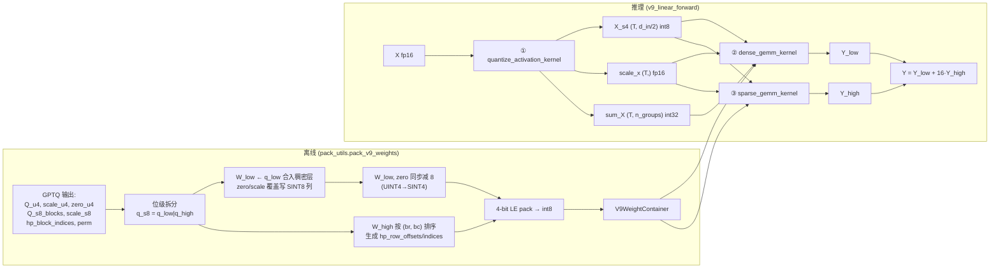

# V9 True-Quant Triton Kernel 套件实现说明

> 目标读者：需要理解 `kernel/triton_kernel/` 下各模块做了什么、用到哪些技术、为什么这样设计的后续贡献者。
> 对应源码：`kernel/triton_kernel/{pack_utils,activation_quant,dense_u4s4_gemm,sparse_s4s4_gemm,v9_linear}.py`
> 算法依据：`kernel/research/kernel_algorithm.md`、`kernel/research/triton_kernel_prompt.md`

---

## 1. 总览

V9 True-Quant 推理套件把"5% 子矩阵块走 INT8、95% 走 UINT4"的 GPTQ 混合精度权重，落成**只有两条 4-bit 计算路径**的 Triton kernel 实现。整条推理链条只需要 3 个 GPU kernel：

| 阶段 | Kernel | 数学内容 | 产出 |
|---|---|---|---|
| ① Activation 量化 | `activation_quant.quantize_activation_kernel` | `X → SINT4(q) + scale_x + sum_X` | 打包字节流 + 每 token scale + 每 group 列和 |
| ② 稠密低位 GEMM | `dense_u4s4_gemm.dense_gemm_kernel` | `Y_low = dequant(W_low ⊗ X_s4)` | `(d_out, T) fp16` |
| ③ 稀疏高位 GEMM | `sparse_s4s4_gemm.sparse_gemm_kernel` | `Y_high = dequant(W_high ⊗ X_s4)` | `(d_out, T) fp16` |

最终 `Y = Y_low + 16 × Y_high`（`v9_linear.v9_linear_forward`）。

### 关键技术一览

- **离线位级拆分**：把 SINT8 块在打包阶段一次性拆成低 4 位（`UINT4`）+ 高 4 位（`SINT4`），低位**合并**进全稠密的 `W_low` 层，高位做成 **2D 块稀疏** BSR 层。
- **UINT4 → SINT4 离线偏移**：`W_low` 和 `zero_u4` 同时减 8，epilogue 数学等价，运行时 `tl.dot` 走**统一的 SINT4 × SINT4 MMA**，屏蔽 Triton 不支持 UINT4 dtype 的限制。
- **BSR (Block-CSR) 稀疏布局**：高位块按 block_row 排序 + `hp_row_offsets` 索引指针，kernel ② 按输出行 tile 调度，无 atomic、无 scatter。
- **per-group 对称/非对称混合量化**：UINT4 列组用非对称（`zero_u4 ≠ -8`），INT8 列组用对称（`zero_u4 = 0 - 8 = -8`），通过覆盖写 `scale_u4[:, bc]` 与 `zero_u4[:, bc]` 把两种路径在 epilogue 里合流成同一个公式。
- **融合 activation 量化**：一次 kernel launch 同时产出 `X_s4`（打包字节）、`scale_x`、`sum_X`，避免三次独立遍历 `X`。
- **4-bit little-endian packing**：`byte = (high << 4) | (low & 0x0F)`，packed shape `(..., D/2) int8`，与 Triton 加载粒度对齐。
- **SM89 INT8 Tensor Core**：`tl.dot(int8, int8, out_dtype=tl.int32)` 在 Ada 架构下下沉到 `mma.sync.s8.s8.s32`，兼作 SINT4 运算（输入值域 `[-8, 7]` 天然是合法 int8 子集）。
- **Autotune**：稠密/稀疏 GEMM 都用 `@triton.autotune` 在若干 `(BM, BN, BK, num_warps, num_stages)` 配置里挑最优。

---

## 2. 数据流与权重容器



### `V9WeightContainer` 字段（`pack_utils.py`）

| 字段 | 形状 | dtype | 含义 |
|---|---|---|---|
| `W_low_packed` | `(d_out, d_in/2)` | int8 | 稠密层 SINT4，LE packed。SINT8 块的低 4 位已合入此处 |
| `W_high_blocks_packed` | `(n_hp, brow, bcol/2)` | int8 | 稀疏层 SINT4，LE packed。仅 5% 高精度块的高 4 位（算术右移） |
| `scale_u4` | `(d_out, n_groups)` | fp16 | 反量化 scale；SINT8 列组位置已被 `scale_s8` 覆盖 |
| `zero_u4` | `(d_out, n_groups)` | fp16 | 反量化 zero（**已预减 8**）；SINT8 列组位置为 `-8`（等价于对称 zero=0） |
| `hp_row_offsets` | `(nrow+1,)` | int32 | BSR indptr，`nrow = ⌈d_out / brow⌉` |
| `hp_col_indices` | `(n_hp,)` | int32 | BSR col indices，即每个高精度块的 `bc` |
| `perm` | `(d_in,)` | int32 | act-order 列重排索引 |
| `block_shape` | `(brow, bcol)` | — | 硬编码 `(128, 128)`，与 group_size 对齐 |

---

## 3. 离线打包技术（`pack_utils.py`）

### 3.1 4-bit little-endian 打包

```python
def pack_s4_le(tensor):                   # tensor: int, last dim even
    x = tensor.to(torch.int32)
    low  = x[..., 0::2] & 0x0F            # [0, 15]
    high = x[..., 1::2] & 0x0F
    packed = (high << 4) | low            # int32 in [0, 255]
    return packed.to(torch.int8)          # PyTorch 自动 wrap 到 [-128, 127]
```

- **为什么 little-endian**：Triton 按字节加载 `(BM, BK/2) int8`，解包后 `[low_0, high_0, low_1, high_1, …]` 天然对应原 K 维顺序，GEMM K 方向连续访问无额外 swizzle。
- **依赖 int32 → int8 自动 wrap-around** 而非 `torch.where`，减少一次 element-wise op。

### 3.2 位级拆分与容器构建（`pack_v9_weights`）

```
for 每个 (br, bc) ∈ hp_block_indices:
    q_low  = q_s8 & 0x0F           # [0, 15]，作为 UINT4 写入 W_low[r0:r1, c0:c1]
    q_high = q_s8 >> 4             # 算术右移，SINT4 ∈ [-8, 7]
    scale_u4[r0:r1, bc] = scale_s8       # 覆盖原 UINT4 scale
    zero_u4 [r0:r1, bc] = 0              # 对称量化，zero=0（之后再减 8）

# 全局一次减 8，把 UINT4 值域平移到 SINT4
W_low = W_low - 8                    # [-8, 7]
zero_u4 = zero_u4 - 8                # epilogue 中 (q - zero)*scale 保持不变
```

**为什么 epilogue 不受影响**：`(q_u4 − zero_u4) × scale = ((q_u4 − 8) − (zero_u4 − 8)) × scale`。这条恒等式让离线偏移的开销为 0，运行时不需要任何补偿项。

### 3.3 BSR 布局生成

- 收集所有 `(br, bc, tile)` 后按 `(br, bc)` 字典序排序；
- `hp_col_indices` 就是排序后的 `bc` 向量；
- 用 `torch.bincount(br, minlength=nrow)` 求每行块数，`cumsum` 得到 `hp_row_offsets`（长度 `nrow+1`，标准 CSR indptr）；
- 结果与 cuSPARSE BlockSparse / CUTLASS BSR 兼容，留下后续切换到库实现的口子。

### 3.4 正确性自检

打包路径内置 `assert torch.equal(q_high * 16 + q_low, q_s8)`，保证位级拆分可逆；以及 `hp_row_offsets[-1] == n_hp`，保证 BSR 索引完整。

---

## 4. Fused Activation 量化（`activation_quant.py`）

### 4.1 功能

一次 kernel launch 同时完成 4 件事，对应一行 token 的输出：

1. **act-order permute**：`x = X[t, perm[d]]`，gather 在 kernel 内完成，避免先生成 permuted 副本占用 HBM。
2. **per-token 对称 scale**：`scale_x = max(|x|) / 7`（SINT4 对称最大值 7）。
3. **4-bit 量化 + LE pack**：`q = clamp(round(x / scale_x), -8, 7)`，随后 `byte = (q[1]<<4) | (q[0]&0x0F)`。
4. **per-group 列和**：`sum_X[t, g] = Σ_{k∈group g} q[t, k]`，供稠密 kernel 做非对称量化的 zero 项修正。

### 4.2 技术要点

- **两遍扫描**：Pass 1 以 `BD=512` tile 流式扫一遍求 `max(|x|)`（寄存器装不下整行 4096 元素）；Pass 2 以 `BCOL_K=128` tile 逐 group 量化、打包、累加 `sum_X`。Pass 2 的 tile 大小等于 group_size，每个 group 的累加在寄存器内一次完成。
- **Round-half-away-from-zero 显式实现**：
  ```python
  q = tl.where(q >= 0,
               tl.math.floor(q + 0.5),
               tl.math.ceil(q - 0.5))
  ```
  避开 `tl.extra.cuda.libdevice.rint` 在 Triton 2.2 / 3.x 之间路径迁移的兼容性坑。
- **零行安全**：`max_abs = 0` 时 `scale_safe = 1`、`inv_scale = 0`，整行 `q = 0`，`scale_x = 0` 写回——下游 GEMM 会乘 0，结果仍正确。
- **向量化打包**：Pass 2 对 `BT × BCOL_K` 的 `q_bits` 做 `tl.reshape(q, (BT, BCOL_K//2, 2))`，取偶/奇列 OR 在一起后 `tl.where(p>=128, p-256, p).to(int8)` 一次写回 `BT × BCOL_K/2` 字节。
- **OOB 列的 sum 置零**：`q_i32 = tl.where(mask_d, q_i32, 0)`，避免越界列污染 `sum_X`。

### 4.3 Python 入口

```python
X_s4, scale_x, sum_X = quantize_activation_s4(X_fp16, perm, bcol=128, BT=32, BD=512)
```

Grid: `(ceil(T/BT),)`；`num_warps=4`。

---

## 5. Kernel ① —— 稠密 UINT4 × SINT4 GEMM（`dense_u4s4_gemm.py`）

### 5.1 数学模型（per-group）

对每个 K-group `g`（大小 `BCOL_K=128`），设当前 tile 的 MMA 结果为 `acc_g = W_tile_s4 ⋅ X_tile_s4ᵀ`（int32）。反量化公式：

```
Y_low[i, j] += (acc_g[i, j] − zero_u4[i, g] × sum_X[j, g])
               × scale_u4[i, g] × scale_x[j]
```

其中 `acc_g − zero × sum_X` 精确等价于把 `W` 写成 `(q_u4 − zero)` 后再做 GEMM，但避免了在 K-loop 内每次都实例化 fp16 `W_dequant`。

### 5.2 实现要点

- **纯 SINT4 × SINT4 MMA**：离线阶段 `W_low` 已 −8，与 `X_s4`（本身就是 SINT4）走相同的 `tl.dot(int8, int8, out_dtype=int32)` 路径。Ada SM89 上编译为 `mma.sync.aligned.m16n8k32.s8.s8.s32`。
- **BK == BCOL_K (== 128)**：`tl.static_assert(BK == BCOL_K)`，保证一次 K 迭代正好对应一个反量化 group，epilogue 简单。
- **`tl.join + tl.reshape` 解包**：
  ```python
  low  = packed & 0x0F
  high = (packed >> 4) & 0x0F
  low  = tl.where(low  >= 8, low  - 16, low)
  high = tl.where(high >= 8, high - 16, high)
  tile = tl.reshape(tl.join(low, high), (BM, BK))
  ```
  不依赖 `tl.interleave`（跨版本不稳定），`tl.join` 从 Triton 2.1 起稳定提供。
- **X 以 `(BN, BK)` 加载后 `tl.trans`**：`tl.dot` 要求 `(M, K) × (K, N)`，通过转置让 B 操作数布局正确。Triton 内部会尽量避免 shared memory 复制。
- **FP32 累加**：每个 K-group 把 int32 MMA 结果 dequant 到 FP32 累加到 `y_acc (BM, BN) fp32`，最后一次性 `.to(fp16)` 写回，保证大 `d_in` 下的数值稳定。
- **Autotune**：4 个候选配置覆盖 BM/BN 较宽范围，`key=["d_out", "d_in", "T"]` 按实际维度缓存选型。

### 5.3 Grid 与输出

- Grid: `(ceil(d_out / BM), ceil(T / BN))`
- 输出布局 `Y_low: (d_out, T) fp16`（转置友好：下游相加后再转回 `(T, d_out)`）

---

## 6. Kernel ② —— 2D 块稀疏 SINT4 × SINT4 GEMM（`sparse_s4s4_gemm.py`）

### 6.1 功能

只对 `W_high_blocks_packed` 存储的 5% 高精度块做 MMA。每个 Triton program 拥有一块输出 `Y_high[r0:r1, j0:j1]`，在它所属的 block_row `br` 内走一段 K-loop，跨若干 `bc` 块累加，**无 atomic**、**无 scatter**。

### 6.2 BSR 索引驱动的 K-loop

```python
br = (pid_m * BM) // BROW_K
start = tl.load(hp_row_offsets_ptr + br)
end   = tl.load(hp_row_offsets_ptr + br + 1)

for block_idx in range(start, end):
    bc = tl.load(hp_col_indices_ptr + block_idx)        # K 方向的列 tile 索引
    # 加载 W_high_blocks[block_idx, row_in_blk, :]
    # 加载 X_s4[:, bc*BCOL_K/2 : (bc+1)*BCOL_K/2]
    acc = tl.dot(W_tile, X_tileᵀ, out_dtype=int32)
    y_acc += acc * scale_u4[:, bc] * scale_x
```

- 95% 的 block_row 里 `start == end`，K-loop 不执行，直接落到 `tl.store(y_ptrs, 0)`。对这些 program 来说，除了一次 `tl.store(BM*BN fp16)` 的 HBM 写外没有 MMA 开销。
- **静态断言 `BROW_K % BM == 0 or BM % BROW_K == 0`**：保证 `row_in_blk ∈ [0, BROW_K)`，autotune 候选（`BM=64/128`，`BROW_K=128`）都满足。

### 6.3 反量化公式

由于打包时 SINT8 块所在列组的 `scale_u4[:, bc]` 已被覆盖为 `scale_s8`、`zero_u4[:, bc]` 被置为 0（再减 8 后是 `-8`，但对高位项无关），因此：

```
Y_high[i, j] += acc[i, j] × scale_u4[i, bc] × scale_x[j]
```

推理侧最终 `Y = Y_low + 16 × Y_high`。展开代入 SINT8 块上的恒等式：

```
Y_low_contrib  = (q_low_s4 − (-8)) × scale_s8 × X_dequant
               = q_low_u4 × scale_s8 × X_dequant
16 × Y_high_c  = 16 × q_high_s4 × scale_s8 × X_dequant
合计           = (q_low_u4 + 16 × q_high_s4) × scale_s8 × X_dequant
               = q_s8 × scale_s8 × X_dequant     ✓
```

与标准对称 INT8 反量化完全等价。

### 6.4 Grid

`(ceil(d_out / BM), ceil(T / BN))`，与 kernel ① 相同，便于共享 tile 形状。

---

## 7. End-to-End 封装（`v9_linear.py`）

### 7.1 `v9_linear_forward`

```python
X_s4, scale_x, sum_X = quantize_activation_s4(X, W.perm)      # ①
Y_low  = dense_gemm_u4_s4(W.W_low_packed, X_s4,
                          W.scale_u4, W.zero_u4, sum_X, scale_x)   # ②
Y_high = sparse_gemm_s4_s4(W.W_high_blocks_packed,
                           W.hp_row_offsets, W.hp_col_indices,
                           X_s4, W.scale_u4, scale_x, d_out, d_in) # ③（n_hp=0 时跳过）
Y = (Y_low + 16 * Y_high).T.reshape(*original_shape[:-1], d_out)
```

- 输入支持 `(T, d_in)` 或 `(batch, seq, d_in)`，输出 shape 为 `(..., d_out)`。
- 当层内没有高精度块（`n_hp_blocks == 0`），直接返回 `Y_low`，省掉一次 kernel launch。

### 7.2 `reconstruct_w_fakequant_fp16` / `v9_linear_fakequant`

- `reconstruct_w_fakequant_fp16(W)`：从打包容器还原 `(d_out, d_in) fp16` 的伪量化权重，用于与 kernel 输出做数值交叉校验。
- `v9_linear_fakequant(X, W)`：完整的参考 forward，内部做 permute、per-token SINT4 量化、`X_dequant @ W_fpᵀ`，**使用与 kernel 相同的量化规则**（而不是 FP16 上限），是做数值验证时的黄金参考。

这两个 reference path 不追求性能，循环体在 Python，便于逐块 debug。

---

## 8. 测试与基准

目录结构：

```
kernel/triton_kernel/
├── tests/
│   ├── test_pack_utils.py       # pack/unpack 自验证、位级拆分、BSR 索引
│   ├── test_activation.py       # 对 fp16 基线的 MSE / max-abs 误差
│   ├── test_dense.py            # dense kernel vs fakequant reference
│   ├── test_sparse.py           # sparse kernel vs fakequant reference
│   └── test_end2end.py          # v9_linear_forward vs v9_linear_fakequant
└── benchmarks/
    ├── bench_dense.py           # dense GEMM Triton vs torch.matmul fp16
    ├── bench_sparse.py          # sparse GEMM 随机稀疏度下的吞吐
    ├── bench_linear.py          # 端到端 Linear 对比 fp16 baseline
    └── results/                 # 结果落盘目录（.gitkeep 保持）
```

- `test_pack_utils.py` 对 `pack_s4_le / unpack_s4_le` 做 round-trip，验证 SINT4/UINT4 双向。
- `test_end2end.py` 随机生成 `V9WeightContainer`，比较 `v9_linear_forward` 与 `v9_linear_fakequant`，相对误差阈值依据 SINT4 量化误差上界设定。
- 所有基准脚本在脚本内部以 `__file__` 动态解析输出路径（符合工程约定），`print` 使用英文。

---

## 9. 硬件与精度要点

| 项 | 设置 |
|---|---|
| 目标 GPU | RTX 4090 (Ada, SM89) |
| MMA 指令 | `mma.sync.aligned.m16n8k32.s8.s8.s32`（由 `tl.dot(int8, int8)` 下沉） |
| MMA 精度 | 660 TOPS INT8（4090 spec） |
| Weight 存储 | 4-bit LE packed int8 |
| Scale / Zero | fp16 |
| Activation | fp16 → SINT4 per-token |
| Accumulator | int32 → fp32（dequant 后） → fp16（写回） |
| Group size | 128（与 `bcol` 一致） |
| 高精度块形状 | `brow × bcol = 128 × 128` |
| 典型高精度占比 | 5% |

### 精度链条

```
 X fp16 → quant(per-token SINT4, round-half-away-zero, clamp[-8,7])
       → dot(SINT4, SINT4) → int32
       → (−zero_u4 × sum_X) fp32
       → × scale_u4 × scale_x fp32
       → + 16 × 稀疏修正 fp32
       → to fp16 write-back
```

离线位级拆分 + scale/zero 覆盖保证"SINT8 块的 dequant 等价于对称反量化"，不引入额外误差源；误差与常规 GPTQ-per-group W4A4 在 95% 区域相同，SINT8 区域误差更低（来自全精度 8-bit 表示）。

---

## 10. 与 `kernel_algorithm.md` 的对齐检查

| 算法文档要求 | 本实现位置 |
|---|---|
| 两层数据形态：`W_low` 稠密 + `W_high` BSR | `pack_v9_weights` |
| SINT8 块离线拆分，推理不出现 INT8 | `pack_v9_weights` 的 `q_high / q_low` 分支 |
| 统一 per-group `(1, bcol)` 量化粒度 | `scale_u4/zero_u4` 形状 `(d_out, n_groups)` |
| scale/zero 覆盖写合流 | `pack_v9_weights` 中对 `scale_u4[r0:r1, bc]` / `zero_u4[r0:r1, bc]` 的覆盖 |
| UINT4 → SINT4 离线偏移 | `W_low - 8`, `zero_u4 - 8` |
| Kernel ① 稠密 GEMM per-group epilogue | `dense_gemm_kernel` 的 `k_block → g` 绑定 |
| Kernel ② 2D 块稀疏 + 输出行 tile 调度 | `sparse_gemm_kernel` 的 BSR K-loop |
| 最终合并 `Y = Y_low + 16 × Y_high` | `v9_linear_forward` |
| 无 atomic / 无 scatter | 两个 kernel 都是 program 独占一块输出 tile |

---

## 11. 已知取舍与后续优化空间

1. **Kernel ② 空 block_row 仍然落一次 `tl.store(zeros)`**：对稀疏度 95% 的场景，这部分开销约等于一次 `(BM, BN) fp16` 的 HBM 写（32 KB / program）。若要进一步压缩，可在 Python 侧扫 `hp_row_offsets` 生成非空 block_row 列表，动态生成 grid。
2. **Activation kernel 的两遍扫描**：大 `d_in`（4096）下寄存器装不下整行，Pass 1/Pass 2 必须分开。若 `d_in ≤ BD`（例如 512），可合并为单次扫描做进一步优化。
3. **`tl.trans(x_tile)` 每 K 迭代一次**：可通过让 `X_s4` 存储为 `(BK, T)` 布局来省掉。当前保持 `(T, BK)` 是为了 activation kernel 写出连续。
4. **Pack 阶段 Python for-loop**：`pack_v9_weights` 对每个高精度块走 Python 循环，`n_hp = 2000` 时耗时秒级，但这是离线一次性成本，不影响推理。
5. **BSR 之外的格式**：如果未来接入 cuSPARSE / CUTLASS BlockSparse，现有 `hp_row_offsets + hp_col_indices` 可直接对齐，无需重新打包。
